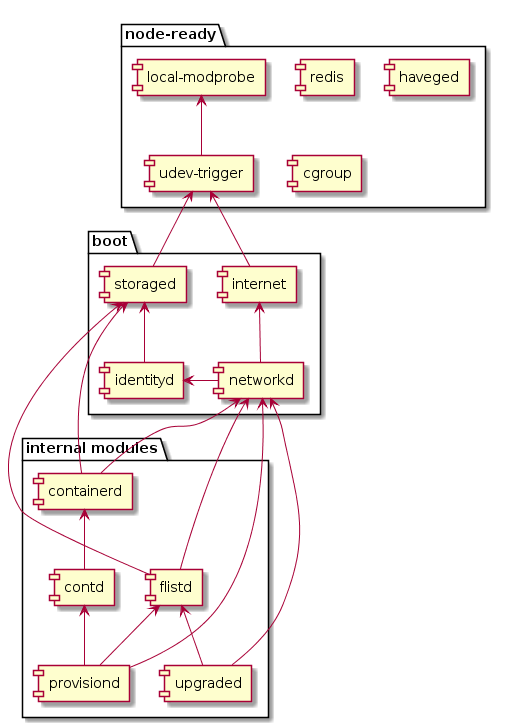

# Services Boot Sequence

Here is dependency graph of all the services started by 0-OS:

## Pseudo boot steps

both `node-ready` and `boot` are not actual services, but instead they are there to define a `boot stage`. for example once `node-ready` service is (ready) it means all crucial system services defined by 0-initramfs are now running.

`boot` service is similar, but guarantees that some 0-OS services are running (for example `storaged`), before starting other services like `flistd` which requires `storaged`

## Boot Flags

- `zos-debug`: means zos is running in debug mode
- `zos-debug-vm`: forces zos to think it's running on a virtual machine. used mainly for development
- `disable-gpu`: if provided GPU feature will be disabled on that node
- `vlan:pub`: set the vlan tag of the node private subnet.
- `vlan:priv`: sets the vlan tag of the node public subnet.
- `pub:mac`: this accepts two values `random` (default), and `swap`. This flag is only effective in case public-config is set (via the dashboard)
  - `random`: means the public interface will have a random (driven from the node id) mac address. this works perfectly well for `home` nodes
  - `swap`: this is useful in case the public ip used in the public-config of the node has to come from the mac address of the physical nic. this flag then will make sure the mac of the physical nic is used by the `public` namespace. This is useful in case you hosting the node in the cloud where the public ip is only allowed to work with the mac assigned to the node physical node

For more details of `VLAN` support in zos please read more [here](network/vlans.md)
