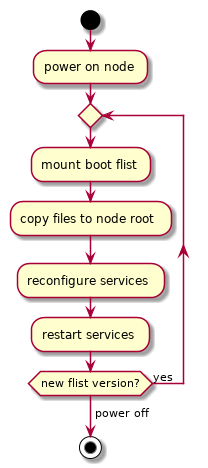

# Upgrade module

## Philosophy

0-OS is meant to be a black box no one can access. While this provide some nice security features it also makes it harder to manage. Specially when it comes to update/upgrade.

Hence, zos only trust few sources for upgrade packages. When the node boots up it checks the sources for the latest release and make sure all the local binaries are up-to-date before continuing the booting. The flist source must be rock-solid secured, that's another topic for different documentation.

The run mode defines which flist the node is going to use to boot. Run mode can be specified by passing `runmode=<mode>` to the kernel boot params. Currently we have those different run modes.

- dev: ephemeral network only setup to develop and test new features. Can be created and reset at anytime
- test: Mostly stable features that need to be tested at scale, allow preview and test of new features. Always the latest and greatest. This network can be reset sometimes, but should be relatively stable.
- prod: Released of stable version. Used to run the real grid with real money. Cannot be reset ever. Only stable and battle tested feature reach this level.

## Booting a new node

The base image for zos contains a very small subset of tools, plus the boot program. Standing alone, the image is not really useful. On boot and
after initial start of the system, the boot program kicks in and it does the following:

- Detect the boot flist that the node must use to fully start. The default is hard-coded into zos, but this can be overridden by the `flist=` kernel param. The `flist=` kernel param can get deprecated without a warning, since it's a development flag.
- The bootstrap, will then mount this flist using 0-fs, this of course requires a working connection to the internet. Hence bootstrap is configured to wait for the `internet` service.
- The flist information (name, and version) is saved under `/tmp/flist.name` and `/tmp/flist.info`.
- The bootstrap makes sure to copy all files in the flist to the proper locations under the system rootfs, this include `zinit` config files.
- Then zinit is asked to monitor new installed services, zinit takes care of those services and make sure they are properly working at all times.
- Bootstrap, umounts the flist, cleans up before it exits.
- Boot process continues.

## Runtime upgrade of a node

Once the node is up and running, identityd takes over and it does the following:

- It loads the boot info files `/tmp/flist.name` and `/tmp/flist.info`
- If the `flist.name` file does **not** exist, `identityd` will assume the node is booted with other means than an flist (for example overlay). In that case, identityd will log this, and disable live upgrade of the node.
- If the `flist.name` file exists, the flist will be monitored on the `https://hub.grid.tf` for changes. Any change in the version will initiate a life upgrade routine.
- Once the flist change is detected, identityd will mount the flist, make sure identityd is running the latest version. If not, identityd will update itself first before continuing.
- services that will need update will be gracefully stopped.
- `identityd` will then make sure to update all services from the flist, and config files. and restart the services properly.
- services are started again after all binaries has been copied

## Technical

0-OS is designed to provide maximum uptime for its workload, rebooting a node should never be required to upgrade any of its component (except when we push a kernel upgrade).



### Flist layout

The files in the upgrade flist needs to be located in the filesystem tree at the same destination they would need to be in 0-OS. This allow the upgrade code to stays simple and only does a copy from the flist to the root filesystem of the node.

Booting a new node, or updating a node uses the same flist. Hence, a boot flist must container all required services for node operation.

Example:

0-OS filesystem:

```
/etc/zinit/identityd.yaml
/etc/zinit/networkd.yaml
/etc/zinit/contd.yaml
/etc/zinit/init/node-ready.sh
/etc/zinit/init
/etc/zinit/redis.yaml
/etc/zinit/storaged.yaml
/etc/zinit/flistd.yaml
/etc/zinit/readme.md
/etc/zinit/internet.yaml
/etc/zinit/containerd.yaml
/etc/zinit/boot.yaml
/etc/zinit/provisiond.yaml
/etc/zinit/node-ready.yaml
/etc/zinit
/etc
/bin/zlf
/bin/provisiond
/bin/flistd
/bin/identityd
/bin/contd
/bin/capacityd
/bin/storaged
/bin/networkd
/bin/internet
/bin
```
