# Basic Networking

In this part we will go through some of basic Networking Concepts that is very related to how networking in zos working

## Components

- [Namespaces](<https://en.wikipedia.org/wiki/Linux_namespaces#Network_(net)>): As you may know linux have the concept of Namespaces which includes (users, net, ....) namespaces. which is basically considered as a full copy of the network stack that is fully isolated from the network stack of the machine
- [Bridge](https://wiki.archlinux.org/title/network_bridge): A network bridge is a virtual network device that forwards packets between two or more network segments. A bridge behaves like a virtual network switch and works transparently.
- veth: Virtual Ethernet (veth) pairs act like a cable connecting two endpoints.

## What we are going to achieve in this doc

We aim to create three network namespaces and establish connectivity between them using bridges and routing rules. Bridges operate at Layer 2, so they only broadcast packets to connected nodes without routing.

- the file setup will looks like
  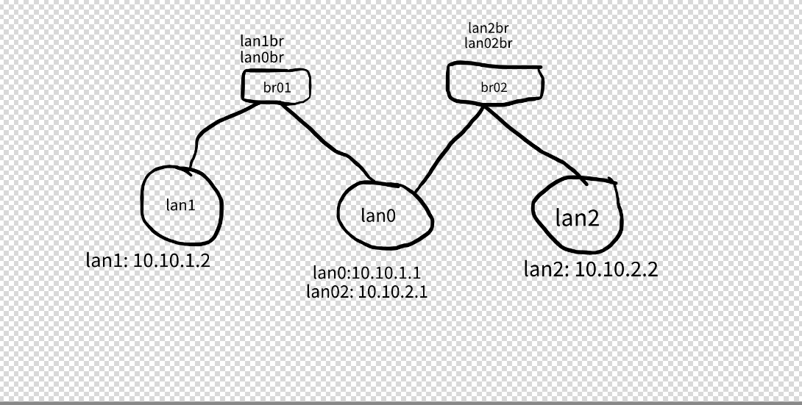

## Steps

### Creating the three namespaces

```
sudo ip netns add lan1
sudo ip netns add lan0
sudo ip netns add lan2
```

for more info about `ip netns` check [this](https://man7.org/linux/man-pages/man8/ip-netns.8.html)
so far we have this
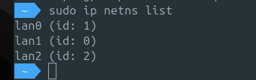
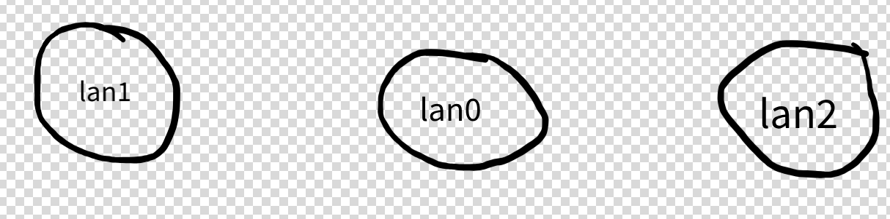

### Executing ip command for a specific namespace

- if you did `ip a` command it will print the host interfaces, but will not print anything from any namespace
- for example to execute `ip a` inside the lan0 namespace you need to do the following

```
ip -n lan0 a
```

- this will print the interfaces inside lan0 which now have only `lo` interface
  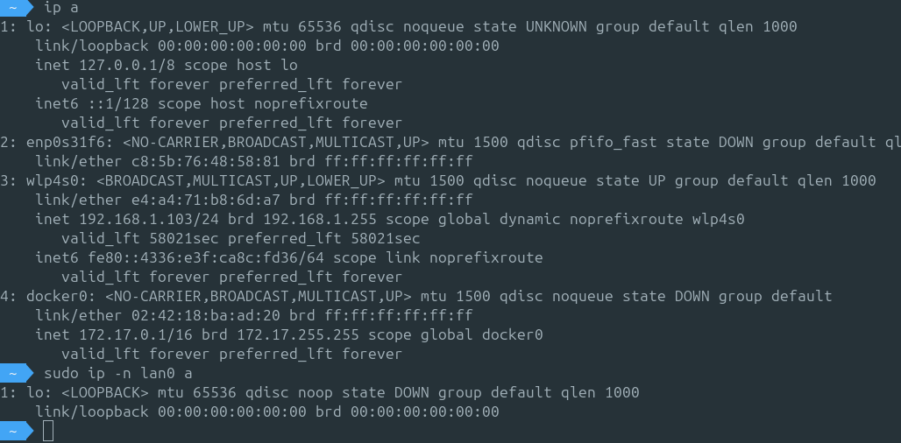
- note that the first `ip a` command shows interfaces from the host, while the second one shows the interfaces inside the namespace. so the `lo` in the first command is not the same `lo` from the second command
- to get a shell inside the namespace so we can execute commands directly inside the namespace without the need to specify the `-n lan0` each time we can do

```
sudo ip netns exec lan0 bash
```

- from the second command we see `lo` device is `DOWN` so to bring it up we do this inside lan0 namespace shell

```
ip l set lo up
```

### Creating the bridges

do this in the host shell

```
sudo ip l add br01 type bridge
sudo ip l add br02 type bridge
```

so far we have this
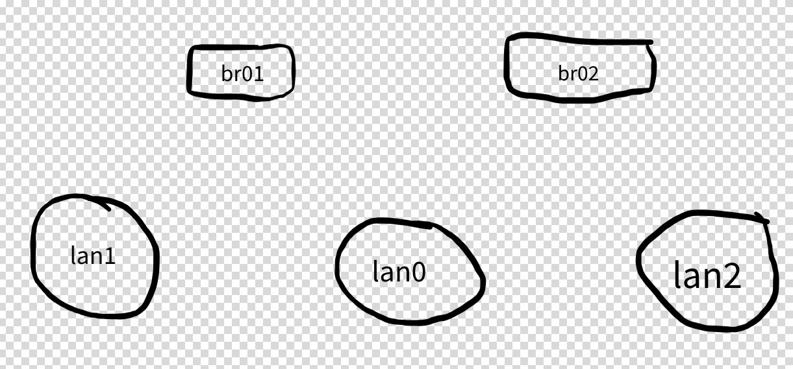

to view the created bridges do `ip l` or `brctl show`


from the above image you can see we have created the bridges but till now we don't have any attached interfaces

### Connecting the wires

- so far we have 3 namespaces and two bridges let's connect the wires between them
- creating veth from `lan1` ns to `br01` bridge
- Connecting a veth between br01 and lan1

```
sudo ip l add lan1 type veth peer name lan1br
```

here if we executer `ip a` we will see something like the following
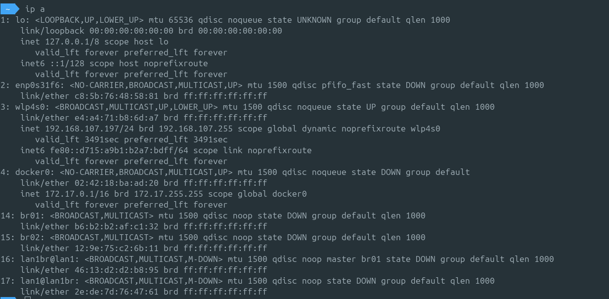

the last two items shows we have link `16` and `17` those are the two ends of the veth that we created so lan1br1 <-> lan1

```
16: lan1br@lan1: <BROADCAST,MULTICAST,M-DOWN> mtu 1500 qdisc noop master br01 state DOWN group default qlen 1000
    link/ether 46:13:d2:d2:b8:95 brd ff:ff:ff:ff:ff:ff
17: lan1@lan1br: <BROADCAST,MULTICAST,M-DOWN> mtu 1500 qdisc noop state DOWN group default qlen 1000
    link/ether 2e:de:7d:76:47:61 brd ff:ff:ff:ff:ff:ff
```

the above command creates veth (link/cable) which have two ends one called `lan1` which we will connect later to `lan1` ns and the other end is `lan1br` which we will connect it later to the bridge `br01`

- connect `lan1br` end to the bridge

```
sudo ip l set lan1br master br01
```

- connect `lan1` end of the veth to `lan1` ns (basically move this end to lan1 ns)

```
ip l set lan1 netns lan1
```

here we if exec `ip a` will find that lan1 end has been moved out of the host interfaces to the lan1 namespace and to see it exec `ip -n lan1 a`
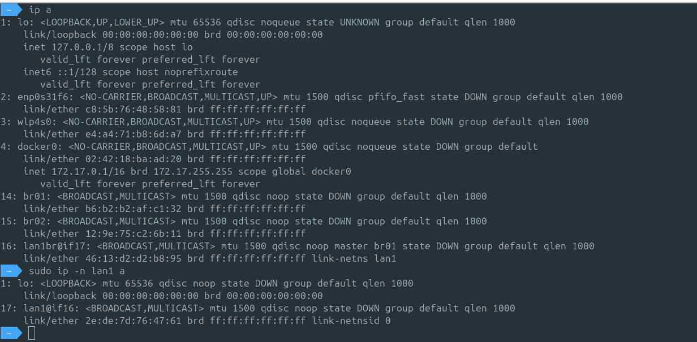

- note that the other end of lan1br is changed to if17 because lan1 is now in a different namesapce we can no longer reference it as lan1 otherwise it is referenced by `if17` which is a unique id generated by the kernel for lan1 also
- also note that the other end of lan1 link in lan1 namespace is if16 which is lan1br but as long as it is not in the same namespace we can not reference it by this name so the unique id is used here
- connecting another veth between br01 and lan0 same as above

```
sudo ip l add lan0 type veth peer name lan0br
sudo ip l set lan0br master br01
sudo ip l set lan0 netns lan0
```

- so far we have done this

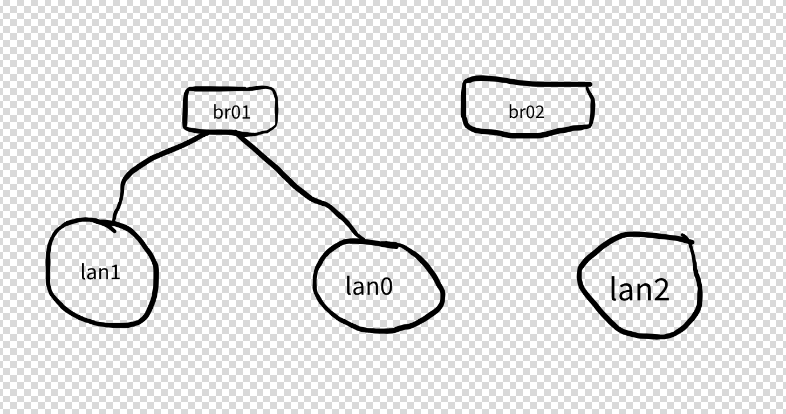

- and here is how it looks like if we did `ip a` in each namespace

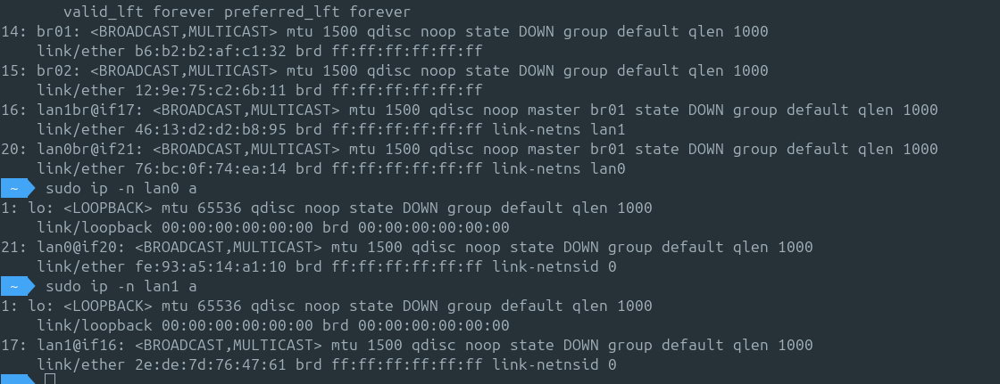

- as you can see everything now is in `DOWN` state let's turn on all of this

```
sudo ip -n lan0 l set lan0 up                          # the end in the namespace
sudo ip -n lan0 a a 10.10.1.1/24 dev lan0              # assign ip
sudo ip l set lan0br up                                # the end in the bridge
sudo ip -n lan1 l set lan1 up                          # lan1 ifc in lan1 namespace
sudo ip -n lan1 a a 10.10.1.2/24 dev lan1
sudo ip l set lan1br up
sudo ip l set br01 up                                  # the bridge
```

lets have a look on the routing table in the name space for example lan1

```
sudo ip -n lan1 r
```

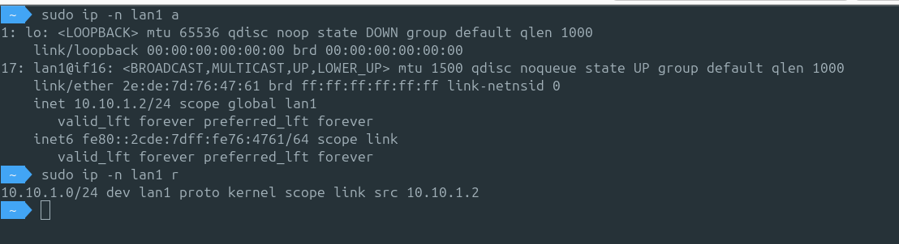

here we will find a route rule automatically added which says any packet that needs to be sent to any ip with `10.10.1.0/24` will go through `lan1` interface and this happened because we assigned it an ip in that range
note:- till now we can not route any packets out side that range, we don't have a default gw yet

- now lets do the same for connecting br01 with lan0 and lan2

```
sudo ip l add lan2 type veth peer name lan2br
sudo ip l add lan02 type veth peer name lan02br
sudo ip l set lan2br  master br02
sudo ip l set lan2 netns lan2

sudo ip l set lan02br master br02
sudo ip l set lan02 netns lan0

sudo ip l set lan02br up
sudo ip l set lan2br up
sudo ip l set br02 up
sudo ip  -n lan0 l set lan02 up
sudo ip  -n lan2 l set lan2 up

# assign ip for lan02 in lan0 namespace
sudo ip -n lan0 a a 10.10.2.1/24 dev lan02
sudo ip -n lan2 a a 10.10.2.2/24  dev lan2
```

#### so far we have this


this means from lan0 ns I can reach lan1 ns and lan2, but till now we can not reach lan1 from lan2, because we only now have the bridges without any special routing rules (default gw is not set yet). so the bridge now is broadcasting the packets on all directly connected devices and the node that this data is for will pick it

### Testing connectivity

if the following ping examples didn't work for you, this maybe a firewall issue try doing this

```
sudo iptables --policy FORWARD ACCEPT
sudo ip netns exec lan0  echo 1 > /proc/sys/net/ipv4/ip_forward        # enable ip forwarding
```

- ping lan1 ns from lan0


- ping lan0 from lan2

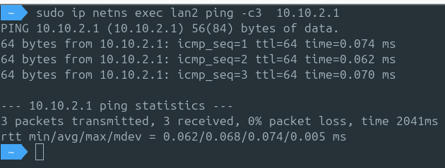

- ping lan2 from lan1 (will not work)

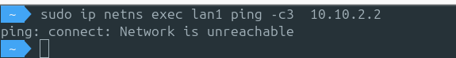

### Establishing connectivity between lan1 and lan2

- Adding a rule to lan1 ns to route to lan2

```
sudo ip -n lan1 r a 10.10.2.0/24 via 10.10.1.1
```

- this means if lan1 namespace wants to send any packets to 10.10.2.0/24 range we direct it to `lan0` ns and lan0 namespace is directly connected to lan2

- Note: ping lan2 from lan1 still not working but now we have a different error message `Destination host unreachable` and you will find it already tried to send the ping request many times instead of the previous error `Network is unreachable` because this time we know we should go through lan1 but we don't guarantee the packet will reach the other end
- Configuring the other way around

  so far we taught the packet how to go from lan1 to lan2 but we didn't configure the other way from lan2 to lan1 to get a response

```
sudo ip -n lan2 r a 10.10.1.0/24 via 10.10.2.1
```

now we have all connected. so we can ping lan1 from lan2 and lan2 from lan1

### NATting

if we did inspect to the packets sent during ping. lets say for example we are doing ping from lan1 to lan2 and we did `tcpdump` on lan2 namespace

```
 sudo ip netns exec lan1 ping  10.10.2.2        # ping lan2 from lan1
```

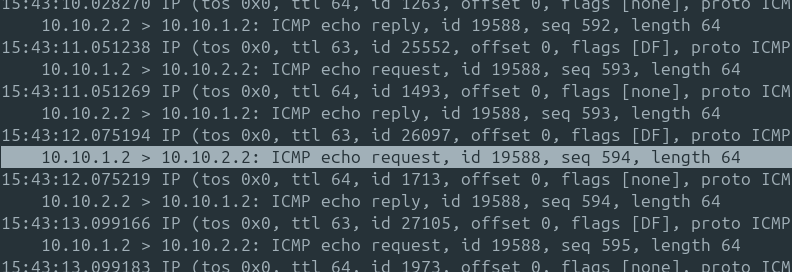

- Here we see the requests are coming from 10.10.1.2 while in our case we deal with lan0 as a router so in lan0 we can add natting rules so the requests are sent to lan2 as if it is from lan0 without lan2 knows lan1 is the one who is sending the request.

- In this case lan0 will change the source MAC and IP to it's interface ip which is 10.10.2.1 and sent to lan2 and lan2 will reply to lan0 then lan0 will forward the reply to lan1

```
sudo ip netns exec lan0 nft add table nat
sudo ip netns exec lan0 nft 'add chain nat postrouting { type nat hook postrouting priority 100 ; }'
sudo ip netns exec lan0 nft add rule nat postrouting masquerade
```

now lan0 works as a router
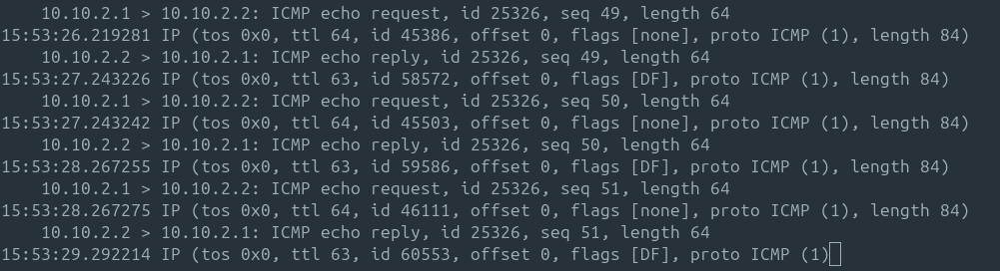

we can now remove the routing rules that we created before and only create a default gw rule in lan1 and lan2

```
# remove old routing rules
sudo ip -n lan1 r d 10.10.2.0/24
sudo ip -n lan2 r d 10.10.1.0/24
# create default gw
sudo ip -n lan1 route add default via 10.10.1.1 dev lan1
sudo ip -n lan2 route add default via 10.10.2.1 dev lan2
```
