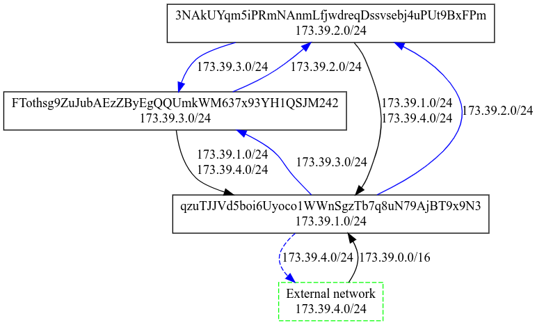
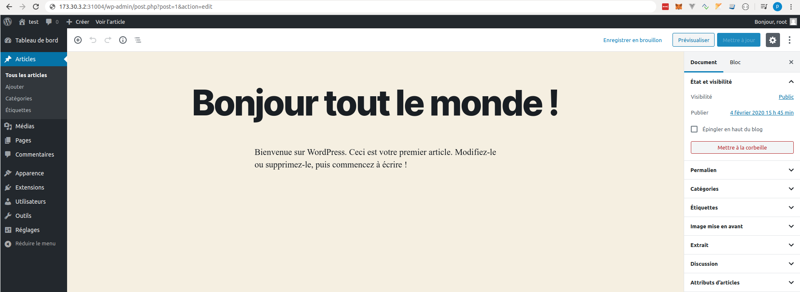
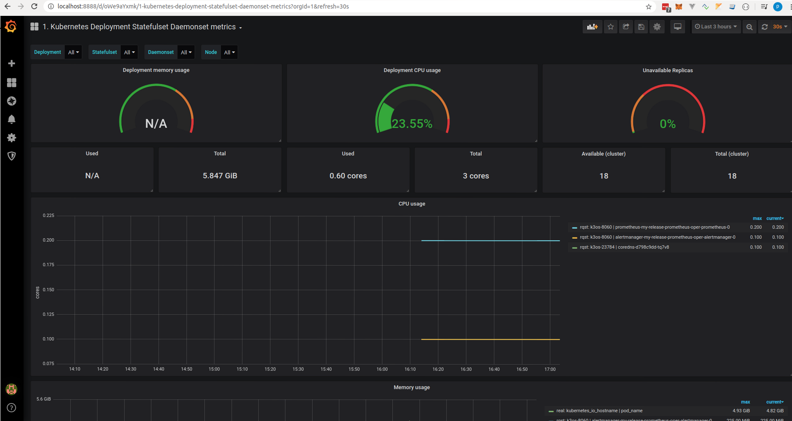
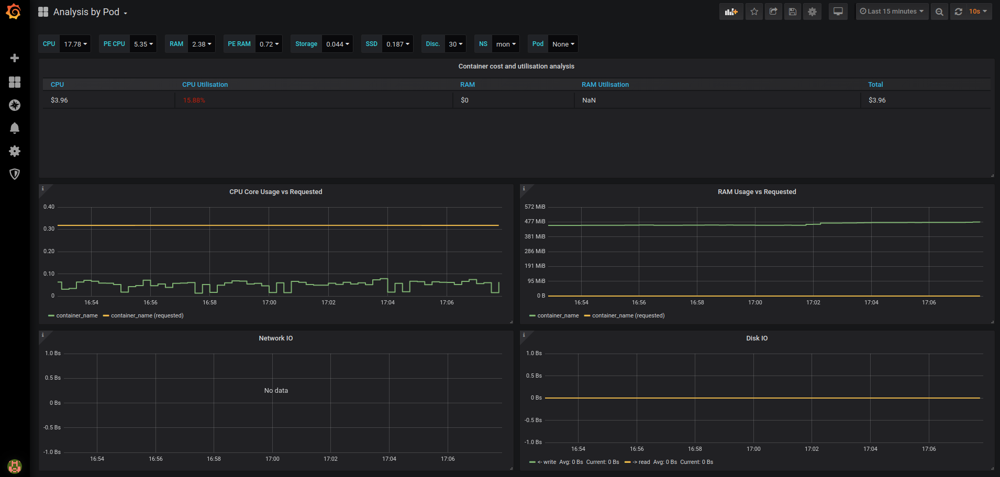

# Kubernetes cluster provisioning, deployment and examples on Threefold Grid

In this guide we will walk you through the provisioning of a full-blown kubernetes cluster
on the TF grid.

We will then see how to connect to it and interact using kubectl on our local machine.

Finally we will go through some examples use cases to grasp the features offered by the cluster.

# TL;DR

If you quickly want to setup a kubernetes cluster and start to play with it, you can launch the [startup script](./startup.sh) (see commands below).

Prerequisite:

- linux based OS
- [kubectl](https://kubernetes.io/fr/docs/tasks/tools/install-kubectl/)
- [wireguard](https://www.wireguard.com/install/)

Optionally (if you want to deploy the charts);

- helm (v3) ([install instructions](https://helm.sh/docs/intro/install))

the script arguments are `startup.sh {GITHUB_ACCOUNT_OR_SSH_PUB_KEY} {CIDR/16} {DURATION} {NUMBER_OF_NODES} {VM_SIZE}`

```
$ chmod +x startup.sh
$ ./startup.sh "ssh-ed25519 AAAAC3NzaC1lZDI1NTE5AAAAIIqFXIWd8mTrzYaQd3sGFNiT7xjSXfOaPYTzvRMD+WI6" "174.40" 2h 3 1
```

This will provision a cluster with 3 nodes one master and two workers for 2 hours.
`{GITHUB_ACCOUNT_OR_SSH_PUB_KEY}` is mandatory as we will push the ssh public key to authorize access to the vm. Don't forget to add the ssh key algorithm before your public key like here `ssh-ed25519`
If you want to specify your github account it needs to be with [a ssh key linked to your account](https://help.github.com/en/enterprise/2.17/user/github/authenticating-to-github/generating-a-new-ssh-key-and-adding-it-to-the-ssh-agent) and you need to specify `github:` in front of your github account e.g.:`./startup.sh github:zgorizzo69 "174.40" 2h 3 1`
`{CIDR/16}` in this example will provision a network with a cidr of 174.40.0.0/16 so the master will have the ip 174.40.2.2 and workers ip: 174.40.3.2 174.40.4.2 etc ...
`{DURATION}` By default is number of days. But also support notation with duration suffix like m for minute or h for hours
There are two `{VM_SIZE}` VM_SIZE=1 (small) and VM_SIZE=2 (medium)

# Provisioning and Deployment of the cluster

Our CLI tool tfuser makes it easy to interact with the TFGrid and provision a kubernetes cluster.

## Tfuser Install

Tfuser is a developer oriented tool used to interact with node on devnet. Let's clone the repository and build the binary.  Please make sure you are using a version of go(lang) that is 1.12 or higher.  Some linux distributions still have 1.10 installed as the default version.

```
$ git clone https://github.com/threefoldtech/zos
$ cd tools
$ make tfuser
cd tfuser && go build -ldflags '-w -s -X github.com/threefoldtech/zos/pkg/version.Branch=fcvm -X github.com/threefoldtech/zos/pkg/version.Revision=c00740b8fbb75746cd02fb5614ccf57342b7a9f4 -X github.com/threefoldtech/zos/pkg/version.Dirty='
$ cd tfuser
$ ./tfuser --help
```

## Identity on the TF Grid (for devnet only)

To interact with the grid we need an identity which is simply some cryptographic keys that we will use to sign transaction on the network.
Let's generate them with tfuser

```
$ tfuser id
new identity generated: 7HZd49ugHzJxQUnHKyQRbmcwWWvKKtoJUndfiiXGTkow
seed saved at user.seed
```

NB: a file named user.seed has been created. This file is sensitive as it stores your private key. Make sure not to loose that file.

## Provisioning

To provision our VMs we first need to setup a network between different Nodes on the TFGrid
We will use devnet Nodes to select some nodes go to :[devnet Cockpit](https://cockpit.devnet.grid.tf/)
We picked three nodes identified by these NodeId

- nodeid1: qzuTJJVd5boi6Uyoco1WWnSgzTb7q8uN79AjBT9x9N3
- nodeid2: 3NAkUYqm5iPRmNAnmLfjwdreqDssvsebj4uPUt9BxFPm
- nodeid3: FTothsg9ZuJubAEzZByEgQQUmkWM637x93YH1QSJM242

Becarefull NodeId is case sensitive

If you want an API to explore the nodes on the grid you can go to : [https://explorer.devnet.grid.tf/nodes](https://explorer.devnet.grid.tf/nodes)

### Networking

We now need to create a network between the nodes. Hopefully tfuser can help us generate the configuration file.
Let's first create a network named `kubetest` with a large cidr `172.30.0.0/16` and write that configuration inside a file `network.json`

```
$ ./tfuser generate --schema network.json network create --name kubetest --cidr 172.30.0.0/16
```

now let's add the nodes that we have selected inside our network by specifying the path to our `network.json` network configuration file. We also specify a port for wireguard to use and a subnet to use on the nodes.

```
$ ./tfuser generate --schema network.json network add-node --node qzuTJJVd5boi6Uyoco1WWnSgzTb7q8uN79AjBT9x9N3  \
				      --subnet 172.30.1.0/24
$ ./tfuser generate --schema network.json network add-node --node 3NAkUYqm5iPRmNAnmLfjwdreqDssvsebj4uPUt9BxFPm \
				      --subnet 172.30.2.0/24
$ ./tfuser generate --schema network.json network add-node --node FTothsg9ZuJubAEzZByEgQQUmkWM637x93YH1QSJM242 \
				      --subnet 172.30.3.0/24
```

there are two levels here :

- one for the global network with a cidr /16
- one for network resources on the node with a cidr /24. All workloads in this network resource will receive an IP from this subnet. The subnet must be part of the CIDR provided when the network is created.

**NOTE** that you can't give the same subnet to all of your nodes. Each node must be assigned a different /24 subnet that is part of the global /16 of the network.

We will need an external access to the network to be able to ssh into our VMs.

```
$ ./tfuser generate --schema network.json network add-access --node qzuTJJVd5boi6Uyoco1WWnSgzTb7q8uN79AjBT9x9N3 \
				       --subnet 172.30.4.0/24 --ip4 > wg.conf
```

We generated the wireguard, a secure and fast VPN, configuration file that we will use here after in this guide.
Note that we can also ask for an ipv6 configuration for `add-access` command only if you remove the --ip4 flag.

here is an example

```
$ ./tfuser generate --schema network.json network add-access --node BpTAry1Na2s1J8RAHNyDsbvaBSM3FjR4gMXEKga3UPbs \
				      --subnet 172.30.4.0/24 > wg.conf
```

Let's take a look at a graphical representation of our network

```
$ ./tfuser generate --schema network.json network graph
```

This will generate network.json.dot file. You can copy paste the content on a website like [graphiz](https://dreampuf.github.io/GraphvizOnline) to see the visual representation of the network we defined.



Now we have a nodes in a network definition ready to be provisioned. Let's use our seed to sign the transaction and ask for a 2 days provision (by default duration is in days).

```
$ ./tfuser provision --schema network.json --duration 2 --seed user.seed \
				      --node qzuTJJVd5boi6Uyoco1WWnSgzTb7q8uN79AjBT9x9N3 \
				      --node FTothsg9ZuJubAEzZByEgQQUmkWM637x93YH1QSJM242 \
				      --node 3NAkUYqm5iPRmNAnmLfjwdreqDssvsebj4uPUt9BxFPm
Reservation for 48h0m0s send to node qzuTJJVd5boi6Uyoco1WWnSgzTb7q8uN79AjBT9x9N3
Resource: /reservations/2406-1
Reservation for 48h0m0s send to node FTothsg9ZuJubAEzZByEgQQUmkWM637x93YH1QSJM242
Resource: /reservations/2407-1
Reservation for 48h0m0s send to node 3NAkUYqm5iPRmNAnmLfjwdreqDssvsebj4uPUt9BxFPm
Resource: /reservations/2408-1
```

you can check the status of the provision with the live command

```

$ ./tfuser live --seed user.seed --end 3000
ID:2406-1 Type:   network expired at:31-Jan-2020 16:18:31state:     ok  network ID:
ID:2407-1 Type:   network expired at:31-Jan-2020 16:18:31state:     ok  network ID:
ID:2408-1 Type:   network expired at:31-Jan-2020 16:18:31state:     ok  network ID:

```

We will now use the wg.conf file previously generated to connect to our network with wireguard a secure and fast vpn.
be sure to install wireguard and then simply run this command to create a network interface and join the defined network

```
$ wg-quick up ./wg.conf
```

We have setup and provision a network on the grid that we can join through wireguard.
Let's now provision some Kubernetes VM on those nodes

### Provision

Let's provision a kubernetes VM on our first node and assign an IP allowed in the network `kubetest` defined here above.
Replace `SSH_PUB_KEY` by your ssh public key and ssh key algorithm e.g. `"ssh-rsa AAAAB3NzaC1yc2EAAA.."`. We choose an IP for the VM that is part of the subnet we previously defined for the node. We can't choose 172.30.3.1 as it is the IP of the network ressource itself.

```
./tfuser generate --schema kube1.json kubernetes --size 1 --network-id kubetest --ip 172.30.1.2 --secret token --node qzuTJJVd5boi6Uyoco1WWnSgzTb7q8uN79AjBT9x9N3  --ssh-keys "{SSH_PUB_KEY}" &&  \
 ./tfuser -d provision --schema kube1.json --duration 2 --seed user.seed --node qzuTJJVd5boi6Uyoco1WWnSgzTb7q8uN79AjBT9x9N3
```

```
./tfuser generate --schema kube2.json kubernetes --size 1 --network-id kubetest --ip 172.30.2.2 --master-ips 172.30.1.2 --secret token --node 3NAkUYqm5iPRmNAnmLfjwdreqDssvsebj4uPUt9BxFPm  --ssh-keys "{SSH_PUB_KEY}" &&  \
 ./tfuser -d provision --schema kube2.json --duration 2 --seed user.seed --node 3NAkUYqm5iPRmNAnmLfjwdreqDssvsebj4uPUt9BxFPm
```

```
./tfuser generate --schema kube3.json kubernetes --size 1 --network-id kubetest --ip 172.30.3.2 --master-ips 172.30.1.2 --secret token --node FTothsg9ZuJubAEzZByEgQQUmkWM637x93YH1QSJM242  --ssh-keys "{SSH_PUB_KEY}" &&  \
 ./tfuser -d provision --schema kube3.json --duration 2 --seed user.seed --node FTothsg9ZuJubAEzZByEgQQUmkWM637x93YH1QSJM242
```

### Connect to the cluster

At this point you should be able to ping your master node and ssh into it.

Check that wg is up and running.

```
$ sudo wg
interface: wg
  public key: vQyDgg9yHp3OsqosDO/Xyutu7efMaCYGmz5JswJvniQ=
  private key: (hidden)
  listening port: 41951

peer: BQE9qUNPKEH59Fy6B2xyMz0KrRfBDIdDm4Bd23ro8DM=
  endpoint: 185.69.166.246:3561
  allowed ips: 172.30.5.0/24, 100.64.30.5/32
  latest handshake: 2 minutes, 43 seconds ago
  transfer: 14.26 KiB received, 19.14 KiB sent
  persistent keepalive: every 20 seconds

```

log into your VM

```
$ ping 172.30.1.2
$ ssh rancher@172.30.1.2
The authenticity of host '172.30.1.2 (172.30.1.2)' can't be established.
ECDSA key fingerprint is SHA256:Q4kQ94B8QaSbo1EsyI8dQrgBkZyk/USda72c8nwVwIE.
Are you sure you want to continue connecting (yes/no)? yes
Warning: Permanently added '172.30.1.2' (ECDSA) to the list of known hosts.
Welcome to k3OS!

Refer to https://github.com/rancher/k3os for README and issues

By default mode of k3OS is to run a single node cluster. Use "kubectl"
to access it.  The node token in /var/lib/rancher/k3s/server/node-token
can be used to join agents to this server.

k3os-15956 [~]$
```

Let's get all nodes of the cluster

```
k3os-15956 [~]$ k3s kubectl get nodes
NAME         STATUS   ROLES    AGE     VERSION
k3os-15956   Ready    master   3m46s   v1.16.3-k3s.2
k3os-15957   Ready    <none>   2m26s   v1.16.3-k3s.2
k3os-15958   Ready    <none>   1m42s   v1.16.3-k3s.2
```

Copy the config so that we can use kubectl from our local machine. By default it is located in `/etc/rancher/k3s/k3s.yaml` on the master node.

Execute this command on your local machine not in a remote shell

```
$ scp rancher@172.30.1.2:/etc/rancher/k3s/k3s.yaml ./k3s.yaml

> IMPORTANT: Do not forget to update the server IP in the copied yaml file.
> By default, it will be pointing to localhost, this must be changed into the
> IP you used to connect to the VM.
```

If you already have a kube config file usually located in `~/.kube/config`
you can edit it and add the new cluster with the informations written on k3s.yaml

here is an example of `~/.kube/config`

```
apiVersion: v1
clusters:
- cluster:
    certificate-authority-data: LS0tLS1CRUdLKjhdDGhjDHKHKhDBJWakNCL3FBREFnRUNBZ0VBTUFvR0NDcUdTTTQ5QkFNQ01DTXhJVEFmQmdOVkJBTU1HR3N6Y3kxelpYSjIKWlhJdFkyRkFNVFU0TURjME9EQXhOakFlRncweU1EQXlNRE14TmpRd01UWmFGdzB6TURBeE16RXhOalF3TVRaYQpNQ014SVRBZkJnTlZCQU1NR0dzemN5MXpaWEoyWlhJdFkyRkFNVFU0TURjME9EQXhOakPPOIHjkDHDJHGkFnRUddaW9tdVR1MXQ1aVRlZDhHaVFrQ2FrdnRWL2xpRGJ3MUlxSS94dEkKWmUya2Y3Tm1mL0txR3IrMzN5SVZ5Q0tkaEdlelBCbEsvanNUSkZVSWpzdWpJekFoTUE0R0ExVWREd0DezdzedzenTlZIUk1CQWY4RUJUQURBUUgvTUFvR0NDcUdTTTQ5QkFNQ0EwY0FNRVFDSUJFNTYzcUttY2xiClVQWHc2UXJCbWxQUmlrbWdCVnY0VHlkMVZ0TWNXY3JYQWlCVlJPY3RjMTF1TXFrOGJWVHJOVFNiN0lFS3ZkRjAKelluMzhwME41MdLUVORCBDRVJUSUZJQ0FURS0D=
    server: https://172.30.1.2:6443
  name: k3s
- context:
    cluster: k3s
    namespace: default
    user: k3s
  name: k3s
current-context: k3s
kind: Config
preferences: {}
users:
- name: k3s
  user:
    password: 8719c8d71457366ecaff927cf784
    username: admin
```

or leverage the KUBECONFIG environment variable

```
$ export KUBECONFIG=/home/zgo/k3s.yaml
$ kubectl get pods --all-namespaces
$ helm ls --all-namespaces
```

Or specify the location of the kubeconfig file per command:

```
kubectl --kubeconfig ./k3s.yaml get pods --all-namespaces
helm --kubeconfig ./k3s.yaml ls --all-namespaces
```

### Delete a Provision

You can delete a provision based on its ID which is returned by `tfuser live`

```
$ ./tfuser live --seed user.seed --end 3000
ID:2587-1 Type:   network expired at:05-Feb-2020 18:02:23state:     ok  network ID:
```

```
$ ./tfuser delete --id 2587-1
Reservation 2587-1 marked as to be deleted
```

## Workload deployment

### Wordpress example

We will launch a wordpress deployment connected to a mysql database.
Let's first create the mysql deployment including a service, a sceret for the DB password and a persistant volume. By default with k3s persistant volume storage class is [local-path](https://rancher.com/docs/k3s/latest/en/storage/)

```
$ cd ressources/wordpress
$ kubectl create -f 1-mysql-pvc.yaml
persistentvolumeclaim/mysql-persistent-storage created
$ kubectl create -f 2-mysql-secret.yaml
secret/mysql-pass created
$ kubectl create -f 3-mysql-deploy.yaml
deployment.apps/mysql created
$ kubectl create -f 4-mysql-svc.yaml
service/mysql created
```

let's do the same for the wordpress deployment

```
$ kubectl create -f 5-wordpress-pvc.yaml
persistentvolumeclaim/wordpress-persistent-storage created
$ kubectl create -f 6-word-deploy.yaml
deployment.apps/wordpress created
$ kubectl create -f 7-wordpress-svc.yaml
service/wordpress created
$ kubectl get po
NAME                         READY   STATUS              RESTARTS   AGE
mysql-5ddb94d667-whpnx       1/1     Running             0          5m48s
wordpress-76f568758d-qdjgn   1/1     Running             0          8s
wordpress-76f568758d-2qhm2   1/1     Running             0          8s
```

Let's connect to the administrator interface through the wordpress NodePort service that we have just created. Let's first retrieve the port open for that service on the nodes

```
$ kubectl get -o jsonpath="{.spec.ports[0].nodePort}" services wordpress
31004
```

We can browse any nodes url on port 31004 to find the wordpress website e.g. [http://172.30.3.2:31004/](http://172.30.3.2:31004/)
and after some setup screens you will access your articles



### Helm charting

K3s comes with helm support built-in. Let's try to deploy prometheus and grafana monitoring of the cluster through HELM charts.

```
$ kubectl create namespace mon
$ helm install --namespace mon my-release stable/prometheus-operator
$ helm -n mon list
NAME            NAMESPACE       REVISION        UPDATED                                 STATUS          CHART                      APP VERSION
my-release      mon             1               2020-02-04 16:08:41.70990744 +0100 CET  deployed        prometheus-operator-8.5.11 0.34.0
$ kubectl config set-context --current --namespace=mon
$ kubectl get po
NAME                                                     READY   STATUS    RESTARTS   AGE
my-release-kube-state-metrics-778b4d9786-tqp9r           1/1     Running   0          7m34s
my-release-prometheus-node-exporter-xfdgv                1/1     Running   0          7m35s
my-release-prometheus-node-exporter-ngzb4                1/1     Running   0          7m35s
my-release-prometheus-node-exporter-lvmp8                1/1     Running   0          7m35s
my-release-prometheus-oper-operator-69cc584dfb-lxjwp     2/2     Running   0          7m34s
alertmanager-my-release-prometheus-oper-alertmanager-0   2/2     Running   0          7m21s
my-release-grafana-6c447fc4c8-zkc4x                      2/2     Running   0          7m34s
prometheus-my-release-prometheus-oper-prometheus-0       3/3     Running   1          7m10s
```

Let's connect to the grafana interface through the deployment that we have just created.

We setup port forwarding to listen on port 8888 locally, forwarding to port 3000 in the pod selected by the deployment my-release-grafana

```
$ kubectl port-forward deployment/my-release-grafana  8888:3000
Forwarding from 127.0.0.1:8888 -> 3000
Forwarding from [::1]:8888 -> 3000
```

We can browse localhost on port 8888 to find the grafana UI e.g. [http://localhost:8888/](http://localhost:8888/)
The username is `admin` and the default admin password to log into the grafana UI is `prom-operator`
Then you can for instance import a dashboard and use the ID 8588 and don't forget to select the prometheus data source

or the dashboard ID 6879


## Want to know more ?

head toward our more [advanced documentation](advanced_k8s.md) about the features offered by our kubernetes cluster
