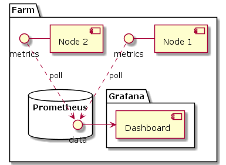
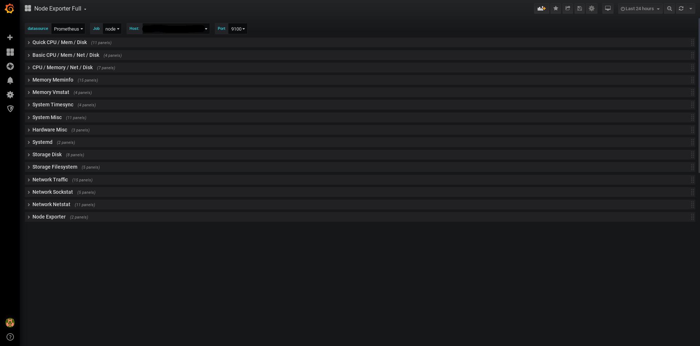

## Proposal to use node-exporter
This document proposes the using of the industrial standard [node-exporter](https://github.com/prometheus/node_exporter). This light-weight utility can run on zos node and it will (out of the box) provide 100's of metrics.

This can also be extended easily to add more metrics that is ZOS specific like:
- reservations related metrics (workloads)

We build a small utility (can be part of 3bot farm management) that generates prometheus config from the farm nodes. This config contains basically node-ids and private IP

### Architecture
#### Node
- zos runs node-exporter
  - node exposes the exporter port only on the management (private) IP so only the farmer can access it
#### Farmer
- Run prometheus with provided configuration on an ubuntu node
- Run grafana
  - Download one of many node-exporter [pre-configured grafana dashboards](https://grafana.com/grafana/dashboards/1860)

## NOTICE
> In case we don't need a listener on ZOS (because that's one of the main zos reasons it's built this way to decrease the attack surface) we can change how node-exporter works to do a PUSH of metrics to local prometheus node instead of polling. Of course then the farmer has to boot the node with the right cmdline arguments. so the node knows where to push the data.

### Pros and Cons
#### Pros
- Very simple solution, many tools already exists that built around the prometheus echo-system including battle tested libraries and very good dashboards.
- Node does not need to do any aggregation, just simple interface that provides real-time values of system health.
- Ability to build averages or aggregation over custom periods, and also query historic data.
- very low memory consumption on the node.
- Security:
  - If we implemented the PUSH mechanism (which requires custom farm config) is a bit harder, but it means the node does not provide any listening ports on **ANY** interface
  - node-exporter has a read-only api
  - node can filter traffic out except from trusted networks (management or yggrasile interface)
- It's probably what the farmer wants since it's standard and used by many other systems.
#### Cons
- Need to expose a listening port on the node

### UML

### Dashboard example

