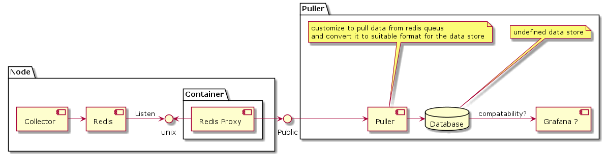

## Proposal to use redis for aggregation
This document proposes the use of a custom aggregation logic to always provide the current avg over the last 5min, 10m, 15min, 1hour, etc..

The aggregated points are then pushed and stored in redis queue that is exposed to the outside, then custom clients can pull this information from redis queue.

The farmer then needs to run this custom tool that pulls data from all aggregation queues (multiple per node) for each node, and store this data somewhere. (not prometheus)

Prometheus can still be used, but in that case it would make sense to only process the 5min samples since then prometheus can do aggregation over the longer time periods from the available 5min samples

The aggregation MUST be done via a lua stored procedure in redis. while it can be perfectly done via external library (no network latency because we will use unix sockets)

Redis must run in a read-only mode (while should be in read-write from the system point of view), redis actually does not have support for this mode, so another custom proxy layer need to be build and run next to redis to only expose the read-only API.

Build our own collectors that collects all node metrics and do the proper calls to the redis (read-write) endpoint.

### Architecture
#### Node
- Zos runs the following:
  - A redis instance for aggregation (should listen only on unix socket)
  - A redis-proxy (better run in a container) to expose a read-only API
    on top of the aggregation redis
- Run custom collectors code that measure system metrics and call the redis stored procedure to report the metric
#### Farmer
- Run a custom poller that go over all nodes in the farm (this list can be generate from the farmer management panel in 3bot)
- Push this data somewhere (not defined but still can be prometheus)
- No visualization tools available, we probably need to build something on top of the used data store to visualize the node metrics.

> We still can use prometheus/grafana solution but we need layers of customer adaptors to be able to pull from redis and push to prometheus then build custom grafana dashboards that visualize the provided metrics

### Pros and Cons
#### Pros
- ?
#### Cons
- Need to build many components from scratch this include:
  - the redis proxy for the read-only API
  - the puller to handle the non standard metric format and adapt it to the database of choice
  - build a custom dashboard
- running a container on the system outside the normal reservation flow
- un-managed memory consumption since if the consumer (puller) did not read the data we will keep all the historic readings (we still can limit on number of samples that we keep in memory)
- we have implemented only a small subset of the metrics that are provided by node-exporter
- Need to expose a listening port on the node

### UML

### Dashboard example
Not defined

### Current list of metrics
This is the list of metrics we have so far:

- health.pool.mounted: pool is mounted (1) or not mounted (0)
- health.pool.broken: pool is broken (1) or not broken (0)
- utilization.pool.size: pool size in bytes
- utilization.pool.used: pool used space in bytes
- utilization.pool.free: pool free space in bytes
- utilization.pool.used-percent: pool usage percent
- utilization.disk.read-bytes: average disk read bytes per second
- utilization.disk.read-count: average number of read operations per second
- utilization.disk.read-time: average read operation time per second
- utilization.disk.write-bytes: average disk read bytes per second
- utilization.disk.write-count: average number of write operations per second
- utilization.disk.write-time: average number of write operations per second
- utilization.cpu.used-percent: cpu usage percent
- utilization.cpu.idle: percent of ideal cpu time
- utilization.cpu.iowait: percent of io-wait cpu time
- utilization.cpu.system: percent of system cpu time
- utilization.cpu.irq: percent of IRQ cpu time
- utilization.cpu.user: percent of user cpu time
- health.sensor.reading: average percent reported by sensor (value/high) * 100
- utilization.mem.size: average total memory size in bytes
- utilization.mem.free: average free memory size in bytes
- utilization.mem.used: average used memory size in bytes
- utilization.mem.available: average available memory size in bytes
- utilization.mem.percent: average memory usage percentage

> Note that metrics are reported per "object" for example there is a bool.size metric for each available pool on the system. [example data](https://gist.github.com/muhamadazmy/968cf5bc10456330ab08cf9d5a38545d)

> Note the example data shows the "current" time slots aggregation (1min, 5min, 1hour, and 1day) not the historic samples.
