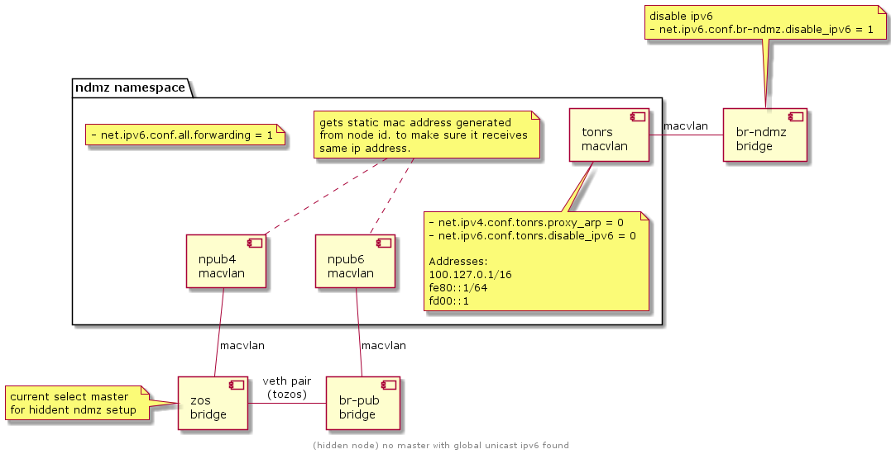

# On boot
> this is setup by `internet` daemon, which is part of the bootstrap process.

the first basic network setup is done, the point of this setup is to connect the node to the internet, to be able to continue the rest of the boot process.

- Go over all **PLUGGED, and PHYSICAL** interfaces
- For each matching interface, the interface is tested if it can get both IPv4 and IPv6
- If multiple interfaces have been found to receive ipv4  from dhcp, we find the `smallest` ip, with the private gateway IP, otherwise if no private gateway ip found, we only find the one with the smallest IP.
- Once the interface is found we do the following: (we will call this interface **eth**)
  - Create a bridge named `zos`
  - Disable IPv6 on this bridge, and ipv6 forwarding
- Run `udhcpc` on zos bridge

Once this setup complete, the node now has access to the internet which allows it to download and run `networkd` which takes over the network stack and continue the process as follows.

# Network Daemon
- Validate zos setup created by the `internet` on boot daemon
- Send information about all local nics to the explorer (?)

## Setting up `ndmz`
First we need to find the master interface for ndmz, we have the following cases:
- master of `public_config` if set. Public Config is an external configuration that is set by the farmer on the node object. that information is retrieved by the node from the public explorer.
- otherwise (if public_config is not set) check if the public namespace is set (i think that's a dead branch because if this exist (or can exist) it means the master is always set. which means it will get used always.
- otherwise find first interface with ipv6
- otherwise check if zos has global unicast ipv6
- otherwise hidden node (still uses zos but in hidden node setup)

### Hidden node ndmz

### Dualstack ndmz
> TODO

## Setting up Public Config
this is an external configuration step that is configured by the farmer on the node object. The node then must have setup in the explorer.
