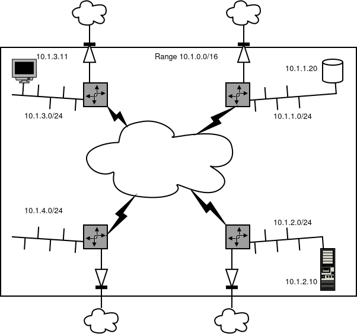

# Zero-Mesh

## What is it

When a user wants to deploy a workload, whatever that may be, that workload needs connectivity.  
If there is just one service to be run, things can be simple, but in general there are more than one services that need to interact to provide a full stack. Sometimes these services can live on one node, but mostly these service will be deployed over multiple nodes, in different containers.  
The Mesh is created for that, where containers can communicate over an encrypted path, and that network can be specified in terms of IP addresses by the user.  

## Overlay Network

Zero-Mesh is an overlay network. That requires that nodes need a proper working network with existing access to the Internet in the first place, being full-blown public access, or behind a firewall/home router that provides for Private IP NAT to the internet.

Right now Zero-Mesh has support for both, where nodes behind a firewall are HIDDEN nodes, and nodes that are directly connected, be it over IPv6 or IPv4 as 'normal' nodes.
Hidden nodes can thus only be participating as client nodes for a specific user Mesh, and all publicly reachable nodes can act as aggregators for hidden clients in that user Mesh.

Also, a Mesh is static: once it is configured, and thus during the lifetime of the network, there is one node containing the aggregator for Mesh clients that live on hidden nodes. So if then an aggregator node has died or is not reachable any more, the mesh needs to be reapplied, with __some__ publicly reachable node as aggregator node.

So it goes a bit like 
The Exit labeled NR in that graph is the point where Network Resources in Hidden Nodes connect to. These Exit NRs are then the transfer nodes between Hidden NRs.

## ZOS networkd

The networkd daemon receives tasks from the provisioning daemon, so that it can create the necessary resources for a Mesh participator in the User Network (A network Resource - NR).

A network is defined as a whole by the User, using the tools in the 3bot to generate a proper configuration that can be used by the network daemon.

What networkd takes care of, is the establishment of the mesh itself, in accordance with the configuration a farmer has given to his nodes. What is configured on top of the Mesh is user defined, and applied as such by the networkd.

## Internet reachability per Network Resource

Every node that participates in a User mesh, will also provide for Internet access for every network resource.
that means that every NR has the same Internet access as the node itself. Which also means, in terms of security, that a firewall in the node takes care of blocking all types of entry to the NR, effectively being an Internet access diode, for outgoing and related traffic only.
In a later phase a user will be able to define some network resource as __sole__ outgoing Internet Access point, but for now that is not yet defined.

## Interworkings

So How is that set up ?

Every node participating in a User Network, sets up a Network Resource.  
Basically, it's a Linux Network Namespace (sort of a network virtual machine), that contains a wireguard interface that has a list of other Network resources it needs to route encrypted packets toward.

As a User Network has a range typically a `/16` (like `10.1.0.0/16`), that is user defined. The User then picks a subnet from that range (like e.g. `10.1.1.0/24`) to assign that to every new NR he wants to participate in that Network.

Workloads that are then provisioned are started in a newly created Container, and that container gets a User assigned IP __in__ that subnet of the Network Resource.

The Network resource itself then handles the routing and firewalling for the containers that are connected to it. Also, the Network Resource takes care of internet connectivity, so that the container can reach out to other services on the Internet.



Also in a later phase, a User  will be able to add IPv6 prefixes to his Network Resources, so that containers are reachable over IPv6.

Fully-routed IPv6 will then be available, where an Exit NR will be the entrypoint towards that network.

## Network Resource Internals

Each NR is basically a router for the User Network, but to allow NRs to access the Internet through the Node's local connection, there are some other internal routers to be added.

Internally it looks like this :

```text
+------------------------------------------------------------------------------+
|                                   |wg mesh                                   |
|    +-------------+          +-----+-------+                                  |
|    |             |          | NR cust1    |   100.64.0.123/16                |
|    | container   +----------+ 10.3.1.0/24 +----------------------+           |
|    | cust1       |      veth|             | public               |           |
|    +-------------+          +-------------+                      |           |
|                                                                  |           |
|    +-------------+          +-------------+                      |           |
|    |             |          | NR cust200  |   100.64.4.200/16    |           |
|    | container   +----------+ 10.3.1.0/24 +----------------------+           |
|    | cust200     |      veth|             | public               |           |
|    +-------------+          +------+------+                      |           |
|                                    |wg mesh                      |           |
|      10.101.123.34/16                                            |           |
|      +------------+                                              |tonrs      |
|      |            |                                    +------------------+  |
|      |  zos       +------+                             |    100.64.0.1/16 |  |
|      |            |      |             10.101.12.231/16|  ndmz            |  |
|      +---+--------+ NIC  +-----------------------------+                  |  |
|          |               |                     public  +------------------+  |
|          +--------+------+                                                   |
|                   |                                                          |
|                   |                                                          |
+------------------------------------------------------------------------------+
                    |
                    |
                    |
                    |   10.101.0.0/16                                 10.101.0.1
 +------------------+------------------------------------------------------------

 NAT
 --------
 rules NR custA
 nft add rule inet nat postrouting oifname public masquerade
 nft add rule inet filter input iifname public ct state { established, related } accept
 nft add rule inet filter input iifname public drop

 rules NR custB
 nft add rule inet nat postrouting oifname public masquerade
 nft add rule inet filter input iifname public ct state { established, related } accept
 nft add rule inet filter input iifname public drop

 rules ndmz
 nft add rule inet nat postrouting oifname public masquerade
 nft add rule inet filter input iifname public ct state { established, related } accept
 nft add rule inet filter input iifname public drop


 Routing

 if NR only needs to get out:
 ip route add default via 100.64.0.1 dev public

 if an NR wants to use another NR as exitpoint
 ip route add default via destnr
   with for AllowedIPs 0.0.0.0/0 on that wg peer

```

During startup of the Node, the ndmz is put in place, following the configuration if it has a single internet connection , or that with a dual-nic setup, a separate nic is used for internet access.

The ndmz network has the carrier-grade nat allocation assigned, so we don'tinterfere with RFC1918 private IPv4 address space, so users can use any of them (and not any of `100.64.0.0/10`, of course)
