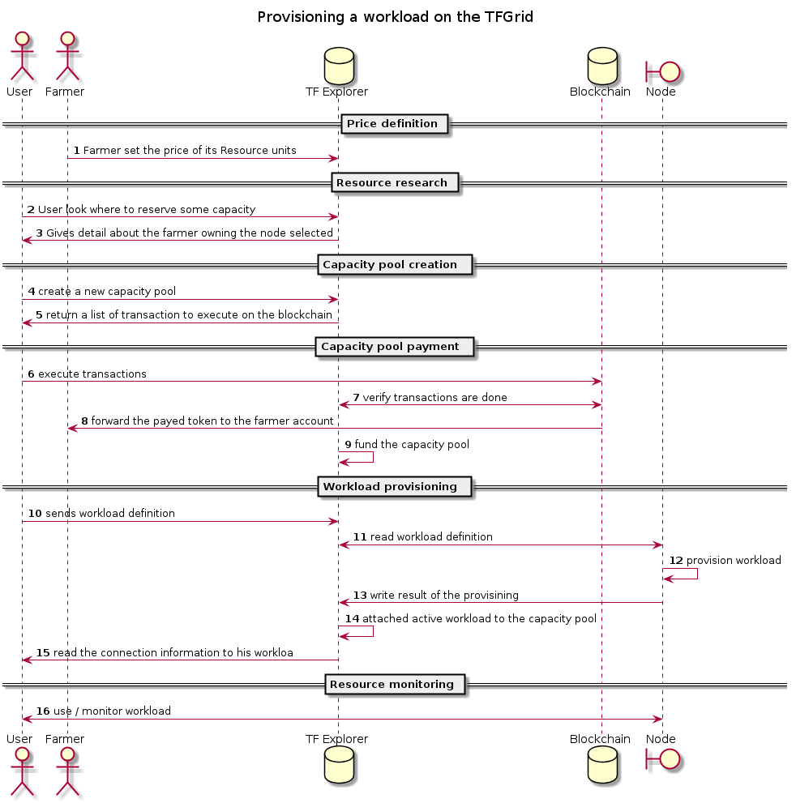

# Provision Module

## ZBus

This module is autonomous module and is not reachable over zbus.

## Introduction

This module is responsible to provision/decommission workload on the node. Since 0-OS has no direct API to use to drive it, the node needs to be fully autonomous.

The way someone can deploy a workload on a node is through a reservation in a [BCDB](https://github.com/threefoldtech/jumpscaleX_core/tree/master/docs/BCDB).

The provision module constantly watch for new reservation address to it. Upon retrieval of a new reservation the node will  automatically
try to provision the workload and report the result to the BCDB.

## Supported workload

0-OS currently support 4 type of workloads:

- container
- volume
- [0-DB](https://github.com/threefoldtech/0-DB) namespace
- private network
- kubernetes VM

Check the [provision.md](provision.md) file to see the expected reservation schema for each type of workload

## Provisioning diagram

## Actors

- **User 3bot**: digital avatar of a user. This is the one buying capacity on the grid.
- **Farmer 3bot**: digital avatar of a farmer. It owns some node in the grid and is responsible to set the price of its node capacity.
- **TF Directory**: Public directory listing all the nodes/farmers in the grid
- **TFChain**: money blockchain, money transaction are executed on this chain using ThreefoldToken (TFT).
- **BCDB**: blockchain database  used to store capacity reservations.
- **Node**: Hardware running 0-OS and responsible to provide capacity to the TFGrid.
