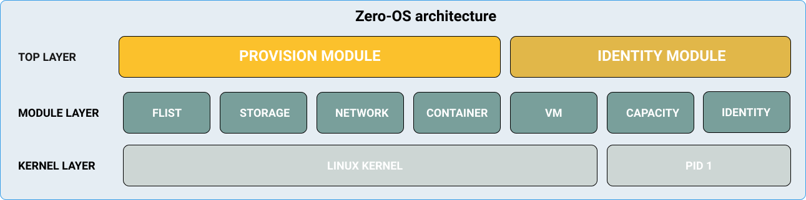

# Table Of Content

- Documentation about version:
  - [Release workflow](release/readme.md)
  - [Migration to V2](migration/readme.md)

- Documentation for each modules:
  - [Container](container/readme.md)
  - [Flist](flist/readme.md)
  - [Identity](identity/readme.md)
  - [Network](network/readme.md)
  - [Provision](provision/readme.md)
  - [Storage](storage/readme.md)
  
- Developer tools
  - [Development environment](../qemu)
  - [tfuser](tfuser/readme.md)
  - [MacOS Development environment](macdev/readme.md)
