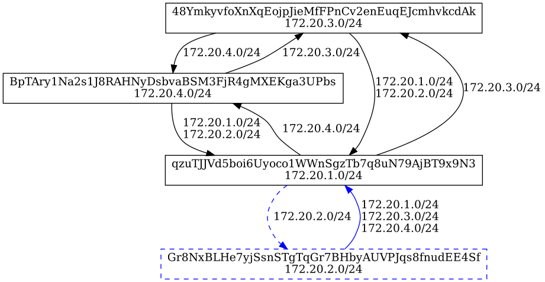

# tfuser CLI

tfuser is a small CLI tool that we created to help developer deploy workload on a 0-OS node during development.

It has 3 main commands:

- **id**: use to generate user identity
- **generate**: used to provisioning reservation schema
- **provision**: used to send schema created with the generate command to a node

## Build tfuser

```
$ cd tools
$ make tfuser
cd tfuser && go build -ldflags '-w -s -X github.com/threefoldtech/zos/pkg/version.Branch=fcvm -X github.com/threefoldtech/zos/pkg/version.Revision=c00740b8fbb75746cd02fb5614ccf57342b7a9f4 -X github.com/threefoldtech/zos/pkg/version.Dirty='
$ cd tfuser
$ ./tfuser --help
NAME:
   tfuser - Let you provision capacity on the ThreefoldGrid 2.0

USAGE:
   tfuser [global options] command [command options] [arguments...]

VERSION:
   0.0.1

COMMANDS:
   id             generate a user identity
   generate, gen  Group of command to generate provisioning schemas
   provision      Provision a workload
   live           show you all the reservations that are still alive
   help, h        Shows a list of commands or help for one command

GLOBAL OPTIONS:
   --debug, -d             enable debug logging
   --bcdb value, -u value  URL of the BCDB (default: "https://explorer.devnet.grid.tf") [$BCDB_URL]
   --help, -h              show help
   --version, -v           print the version
```

## Examples

### Generate a network provisioning schema

Here is a full example how you would use tfuser to create a network schema.

1. create a network from scratch
   `tfuser generate --schema network.json network create --name network --cidr 172.20.0.0/16`

`--schema`: Optional file name to save the reservation schema. If not provided, the schema will be printed on stdout
`--name`: Arbitrary name of your network.
`--cidr`: The prefix which will be used by the network resources in the network.

2. add another node to the network:
   `tfuser generate --schema schema.json network add-node --node qzuTJJVd5boi6Uyoco1WWnSgzTb7q8uN79AjBT9x9N3 --subnet 172.20.1.0/24 --port 12345`

`--schema`: The file name of in which the current schema is stored. The new node
will be added to the schema, and the new schema version will be saved in the file.
`--node`: The ID of the node to add in the reservation.
`--subnet`: The subnet to assign to the network resource on this node. All workloads
in this network resource will receive an IP from this subnet. The subnet must be
part of the `CIDR` provided when the network is created.
`--port`: Optional wireguard listening port on the host. If this is not specified, one will be
generated automatically. It is the responsibility of the caller to ensure this port
is not already in use.
`--force-hidden`: Optional flag which marks the node which is going to be added as hidden, even if it reports itself as having
public endpoints.

A list of node (ids) can be found on the explorers. Currently there are 2:

- devnet explorer: https://explorer.devnet.grid.tf
- testnet explorer: https://explorer.testnet.grid.tf

3. add external access to your network:
   `tfuser generate --schema network.json network add-access --node qzuTJJVd5boi6Uyoco1WWnSgzTb7q8uN79AjBT9x9N3 --subnet 10.1.0.0/24`

`--node`: The node ID of the network resource which is going to act as a gateway for your external access.
`--subnet`: A subnet on your external machine, which will be reachable from inside the network. The wireguard IP of your
external machine will be derived from this subnet.
`--ipv4`: Optional flag to use an IPv4 connection instead of IPv6 for the wireguard endpoint to the access node

An example setup could look something like this:

```bash
./tfuser generate network create --name network --cidr 172.20.0.0/16 > network.json
./tfuser generate --schema network.json network add-node --node qzuTJJVd5boi6Uyoco1WWnSgzTb7q8uN79AjBT9x9N3 --subnet 172.20.1.0/24 --port 12345
./tfuser generate --schema network.json network add-node --node Gr8NxBLHe7yjSsnSTgTqGr7BHbyAUVPJqs8fnudEE4Sf --subnet 172.20.2.0/24 --port 12346
./tfuser generate --schema network.json network add-node --node 48YmkyvfoXnXqEojpJieMfFPnCv2enEuqEJcmhvkcdAk --subnet 172.20.3.0/24 --port 12347 --force-hidden
./tfuser generate --schema network.json network add-node --node BpTAry1Na2s1J8RAHNyDsbvaBSM3FjR4gMXEKga3UPbs --subnet 172.20.4.0/24 --port 12348
./tfuser generate --schema network.json network add-access --node qzuTJJVd5boi6Uyoco1WWnSgzTb7q8uN79AjBT9x9N3 --subnet 10.1.0.0/24
```

Which could produce the following output:

```json
{
  "id": "",
  "user_id": "",
  "type": "network",
  "data": {
    "name": "suitnet",
    "net_id": "",
    "ip_range": "172.20.0.0/16",
    "net_resources": [
      {
        "node_id": "qzuTJJVd5boi6Uyoco1WWnSgzTb7q8uN79AjBT9x9N3",
        "subnet": "172.20.1.0/24",
        "wg_private_key": "ab7d620665bb8396599eeaea64462ac45c56995521337221dcb08a3dbe40044bf38de4a2d8d6017b7a205542a70aec5d83cb7137ac0979383f586d5fde0ec396fdbc4b588dc53ea096c8014955da934a6ae8a911fa20dd694175c9c3",
        "wg_public_key": "rr61w031lia8SKlEy1HqQDm2KeC7xCUHWC0NDhCfsSQ=",
        "wg_listen_port": 12345,
        "peers": [
          {
            "subnet": "172.20.2.0/24",
            "wg_public_key": "Do3rwwzZ611whUXC55Ln79JbZgmN9ekys7MoAXWmim4=",
            "allowed_ips": ["172.20.2.0/24", "100.64.20.2/32"],
            "endpoint": "[2a02:1802:5e:0:225:90ff:fe82:7255]:12346"
          },
          {
            "subnet": "172.20.3.0/24",
            "wg_public_key": "eYa+g59QLNtO2lWu8qVp6DLNl5ZERSCF22D/JjqL4Qk=",
            "allowed_ips": ["172.20.3.0/24", "100.64.20.3/32"],
            "endpoint": ""
          },
          {
            "subnet": "172.20.4.0/24",
            "wg_public_key": "JgZx+H4OxdTXfjr/MA+qobXNXu/Mqp0eJyvBO8X+6Vk=",
            "allowed_ips": ["172.20.4.0/24", "100.64.20.4/32"],
            "endpoint": "[2a02:1802:5e:0:225:90ff:fef4:40af]:12348"
          },
          {
            "subnet": "10.1.0.0/24",
            "wg_public_key": "Nj61KY+BFkGEaslUwEFuFx7ChqUgxvKyndqPB3peaVA=",
            "allowed_ips": ["10.1.0.0/24", "100.64.1.0/32"],
            "endpoint": ""
          }
        ]
      },
      {
        "node_id": "Gr8NxBLHe7yjSsnSTgTqGr7BHbyAUVPJqs8fnudEE4Sf",
        "subnet": "172.20.2.0/24",
        "wg_private_key": "1c78f17aa3f5008056aaa63c75c5b1fd2313e08e3bb03fd9c84c97addfd9504361d5dc82a053ad23c713d469d78844fc0c36cfbee07d1eefb27e55dc4017c398fdd6b6554540c161898654e150eeec43539c4e8a3abd5b75c30b7567",
        "wg_public_key": "Do3rwwzZ611whUXC55Ln79JbZgmN9ekys7MoAXWmim4=",
        "wg_listen_port": 12346,
        "peers": [
          {
            "subnet": "172.20.1.0/24",
            "wg_public_key": "rr61w031lia8SKlEy1HqQDm2KeC7xCUHWC0NDhCfsSQ=",
            "allowed_ips": [
              "172.20.1.0/24",
              "100.64.20.1/32",
              "172.20.3.0/24",
              "100.64.20.3/32",
              "10.1.0.0/24",
              "100.64.1.0/32"
            ],
            "endpoint": "[2a02:1802:5e:0:1000::f6]:12345"
          },
          {
            "subnet": "172.20.4.0/24",
            "wg_public_key": "JgZx+H4OxdTXfjr/MA+qobXNXu/Mqp0eJyvBO8X+6Vk=",
            "allowed_ips": ["172.20.4.0/24", "100.64.20.4/32"],
            "endpoint": "[2a02:1802:5e:0:225:90ff:fef4:40af]:12348"
          }
        ]
      },
      {
        "node_id": "48YmkyvfoXnXqEojpJieMfFPnCv2enEuqEJcmhvkcdAk",
        "subnet": "172.20.3.0/24",
        "wg_private_key": "7ce132f645779347dbed334a74ec998b64bf89af0fcbc4f434e2ec9789c08927f8406631f408deab94c770be020a01025249d54aa91a0814d73ad7fdf293b61075efc65c49262e709189cdb382c32f7d6658ed283631ca728a11627c",
        "wg_public_key": "eYa+g59QLNtO2lWu8qVp6DLNl5ZERSCF22D/JjqL4Qk=",
        "wg_listen_port": 12347,
        "peers": [
          {
            "subnet": "172.20.1.0/24",
            "wg_public_key": "rr61w031lia8SKlEy1HqQDm2KeC7xCUHWC0NDhCfsSQ=",
            "allowed_ips": [
              "172.20.1.0/24",
              "100.64.20.1/32",
              "172.20.2.0/24",
              "100.64.20.2/32",
              "172.20.4.0/24",
              "100.64.20.4/32",
              "10.1.0.0/24",
              "100.64.1.0/32"
            ],
            "endpoint": "185.69.166.246:12345"
          }
        ]
      },
      {
        "node_id": "BpTAry1Na2s1J8RAHNyDsbvaBSM3FjR4gMXEKga3UPbs",
        "subnet": "172.20.4.0/24",
        "wg_private_key": "9658f466eb55481d5f3d00de9e5bee880c44f7434d0e62d8a7f4371284135e67f4e3bdd38c093b4b7ef1c485973ebbdddc21735627cf40825e8c29c5d3b86f6e930dbff2d70c8c0ebffd3ec2af2d48f7b5c76ea8f541358793e85483",
        "wg_public_key": "JgZx+H4OxdTXfjr/MA+qobXNXu/Mqp0eJyvBO8X+6Vk=",
        "wg_listen_port": 12348,
        "peers": [
          {
            "subnet": "172.20.1.0/24",
            "wg_public_key": "rr61w031lia8SKlEy1HqQDm2KeC7xCUHWC0NDhCfsSQ=",
            "allowed_ips": [
              "172.20.1.0/24",
              "100.64.20.1/32",
              "172.20.3.0/24",
              "100.64.20.3/32",
              "10.1.0.0/24",
              "100.64.1.0/32"
            ],
            "endpoint": "[2a02:1802:5e:0:1000::f6]:12345"
          },
          {
            "subnet": "172.20.2.0/24",
            "wg_public_key": "Do3rwwzZ611whUXC55Ln79JbZgmN9ekys7MoAXWmim4=",
            "allowed_ips": ["172.20.2.0/24", "100.64.20.2/32"],
            "endpoint": "[2a02:1802:5e:0:225:90ff:fe82:7255]:12346"
          }
        ]
      }
    ]
  },
  "created": "0001-01-01T00:00:00Z",
  "duration": 0,
  "to_delete": false
}
```

#### Network provisioning graph

Once you have a reservation schema of a network, it is possible to create a
dot file of the schema, which can then be turned into an image of the network
graph. This shows how different network resources will reach each other.

`tfuser generate --schema network.json network graph`

Will print the dot file on stdout. You can then use your preferred layout engine
to generate the image.

Example image generated from the schema above:



### Generate a container provisioning schema

```shell
tfuser generate --schema ubuntu.json container \
--flist https://hub.grid.tf/tf-official-apps/ubuntu-bionic-build.flist \
--corex \
--entrypoint /bin/bash \
--network ZKhTrpy7tubzG5fxqdsWzwoXbEhtwJ1yxDBz8xDUf9J \
--env KEY:VALUE
```

### Provision a workload on a node

To provision a workload on a node, you need to have a user identity. It is used to sign the schema before sending to the node.  
Generate an identity using `tfuser id`. This command will generate a `user.seed` file that you need to use with the provision command.

```shell
tfuser provision --schema container.json --duration 2 --seed user.seed --node {nodeID}
```

### Kubernetes Provisioning

Check the get started guide [here](../kubernetes/getstarted.md)
