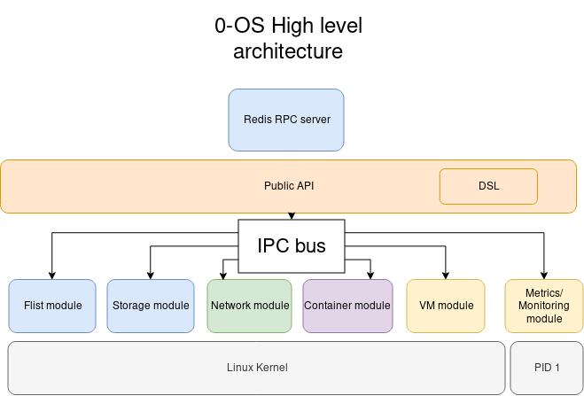

# 0-OS v2 brainstorming Session 1

## Attendees:
- @zaibon
- @delandtj
- @maxux
- @azmy
- @leesmet
- @glendc

## Agenda

1. Brainstorming about general architecture
 - Identification of the features wanted
 - Identification of different deamon/binary
 - Draft of different components

2. Definition of milestones

3. Creation of stories/issue and assignments

[Main repo for research](https://github.com/threefoldtech/0-OS_research)

## Notes

- [Prelimiray note on google doc](https://docs.google.com/document/d/1qAO1z3VCCt78u_f9zTG-r_EEcCYRLnkrVSaLAw4Psq8/edit)

- General archictecure:
 - For Public RPC, we can use RESP protocol, but not use plain redis. RPC system to be researched
 - the module of 0-os, they need to be or daemon or binary that can be upgraded at runtime
 - @delandtj / @glen : formalize the concept of DSL next to the public API

- Different high level modules
 - flist
 - storage
   - disks mangement
   - 0-db
 - network
   - CNI spec
   - port sharing management
   - zerotier
   - ipv6
   - service discovery (envoy)
   - wireguard
 - container
   - OCI spec
   - runc (is runc the implementation we want to use ?)
 - VM
   - QEmu/KVM
 - metric/monitoring
   - rtinfo
   - prometheus node-exporter
   - redis aggregation
   - UI about system status Read Only

- @delandtj/azmy : define/desing public API/DSL

### Milestones
 - now:
   - Boot 0-OS and configure a one network interface
   - Interface defined for high level module
   - DSL/public API concept formalized
 - later:
   - starting an etcd container
   - booting ubuntu VM

