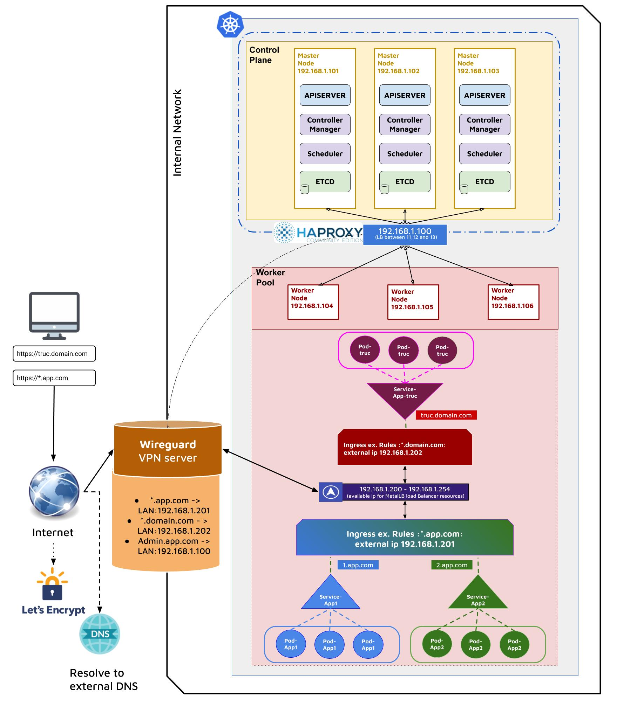

# Installing k8s on the tfgrid

## Overview
Containers on the grid runs on node booting zos with 0-fs filesystem.
Those have some characteristics to keep in mind to make it work with k8s
 zOS has no virtual machine capabilities .  it can be implemented 
With firecracker adapting the kernel config with 5.4 and virtio-fs on top of 0-fs. 
zOS is multi user and is not accessible from the outside.
0-OS root filesystem is a tmpfs. Any new binaries that we want to include on the node should or be included in the base image or be downloaded using an flist.
 
On the tf grid to reserve capacity we must go through the reservation process that includes storage and networking setup. 
 
Kubernetes need to access the node with root capabilities. Kubernetes master needs to be able to communicate with its node. We need to communicate with the kubernetes API to deploy and monitor the containers. Moreover if we want to expose containers to the outside we need to make traffic inbound to the kube-proxy. Usually cloud providers when deploying a k8s cluster provision a static IPv4 and load balance traffic between the cluster nodes.
 
That’s why we can’t run the kubernetes binaries as a flist image but we should use the node as a dedicated machine for this purpose. We would also need a load balancer that we can access from the outside to target the cluster nodes.
 
We found a production ready lightweight implementation of k8s called k3s that would fit our needs (bare metal, open source etc ..). 
We managed to create a kubernetes cluster on grid machines running zOS with k3s. We deployed pods, persistent volume (local filesystem), service and ingress. 
Pods were running docker image launched with containerd.
We were able to reach the pod workload through the ingress as we were able to reach the node ip.

## overall architecture of beta installation

Here we have three master nodes behind a VIP created to ensure high availability. We use HAProxy and keepalive for that purpose.

all the nodes will be part of the same wireguard network along with the user that deployed the cluster. So he will be able to access the apiserver of the master nodes to execute command (via kubectl).

## Ingress and LoadBalancer 

[Bare-metal environments](https://kubernetes.github.io/ingress-nginx/deploy/baremetal/) lack the ability to supply network load balancers on-demand. In a cloud provider environment  a single Kubernetes manifest suffices to provide a single point of contact to the Ingress controller to external clients and, indirectly, to any application running inside the cluster. Here we require a slightly different setup to offer the same kind of access to external consumers. 

MetalLB provides a network load-balancer implementation for Kubernetes clusters that do not run on a supported cloud provider, effectively allowing the usage of LoadBalancer Services within any cluster.

### TLS 

to be able to use automatic TLS delivery like letsencrypt we should have a public ip that points to our ingress externalIP. We should be able to create a route from an entry point to the TFgrid down to our ingress controller that runs on our cluster worker nodes 

## Storage

When deploying an application that needs to retain data, you’ll need to create persistent storage. Persistent storage allows you to store application data external from the pod running your application. This storage practice allows you to maintain application data, even if the application’s pod fails.
K3s comes with a Local Path Provisioner and this enables the ability to create persistent volume claims out of the box using local storage on the respective node.

K3s also supports Longhorn. Longhorn is a distributed block storage system for Kubernetes. Longhorn creates a dedicated storage controller for each block device volume and synchronously replicates the volume across multiple replicas stored on multiple nodes. The storage controller and replicas are themselves orchestrated using Kubernetes

