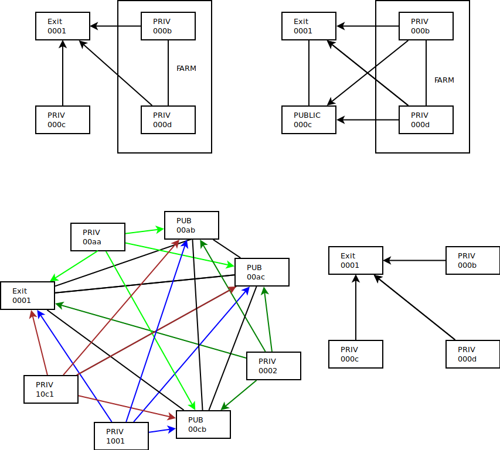

What needs to be implemented
  - all hidden nodes establish connections to public peers
  - all hidden nodes do not connect to hidden nodes, but only to the publicly reachable nodes.
  for that, they add the prefixes for that netresource that is hidden and the route through the exit node
  - the public nodes do not need to add a peer destination address for hidden nodes,
  as they will be contacted by the hidden nodes for 2 reasons
    - the setup of fe80::xxxx does a neighbor discovery so a packet gets sent
    - PersistentKeepalive starts the connection regardless of packets ?



  - Unidirectional : the nodes that receive the connections don't have an `EndPoint` (in WireGuard terms) configured for peers that are HIDDEN and NOT in same localnet of farm.

```
[Peer]
PublicKey = h/NU9Qnpcxo+n5Px7D4dupiHPaW2i3J9+pygRhLcp14=
AllowedIPs = 2a02:1807:1100:01bb::/64,....
PersistentKeepalive = 20
```
  - Bidirectional : standard wireguard config with EndPoint on both sides.

```
[Peer]
PublicKey = frILGCtt5/55b9ysgyeSdzIv777cmvTNvIsvJGWd/Qc=
AllowedIPs =  2a02:1807:1100:11cd::/64,...
EndPoint = 91.85.221.101:23123
PersistentKeepalive = 20
```

### Differentiation beween hidden and public

  - Node is fully Public (IPv[46])
    Then the Wireguard Interface can be created in Namespace 1 of the Kernel
  
  - __Node is fully Private :__
    - it has an RFC1918 IPv4 Address and/or
    - it has a routable but firewalled IPv6

    -> Then the Wireguard Interface can be created in Namespace 1 of the Kernel

  - __Node is part of a farm, so Namespace 1 is hidden, but it can connect Publicly__
    - through a physical connection (direct interface, vlan, macvlan, ...)
    - through special routing over tunnels (vxlan, GRE, mpls, ...)

    -> Then the Wireguard Interface needs to be created in a Namespace that holds the public IP address(es), so it is reachable with a default route.

    For this to work, the Node that is flagged as a Node responsible for providing ExitPoints of Tenant Networks needs to:
      - request a prefix for the Network Resource of the Tenant Network
      - request the public setup for it's public namespace
      - set up the public namespace
        - add publicly connected interface in the namespace
        - add the public IPv[46] to it
      - from there wireguard Interfaces can be created to be sent into the Network Resources of the ExitPoints
      - once such a Public namespace is created, there needs to be a new one created for every X (TODO: define max number of running Wireguards in a Public Namespace)

**NOTE: there is a strong distinction beween**
  - a public namespace for Wireguard interfaces
  - an exitpoint with it's own Public IP
    - for IPv4, that means that and IPv4 address needs to be bought, as without it, there is no NAT to the Routable Internet available. 
    - Although we actually could provide a global Routing Namespace that does NAT for all IPv4 Network resources in all Tenant Networks, it's just setting it up with correct firewall rules, and proper vrf with route leaking and conntrack zones (LATER). 
    NOTE: This might aver to be really necesary for reaching to the internet, as IPv6 coverage is still very low in a lot of regions, let alone implemented at ISP level. E.g. Telenet has less than 60% coverage of the home networks, as many routers are not updatable and until they break will not be replaced. (got it from a telenetter himself)

As it is, there are no firewall rules necessary, as nothing lives in that namespace, it's only used as a conduit for Wireguard listening ports and their associated traffic.
So for the Wireguard Public namespace:
```bash
#!/usr/bin/env bash
ip link add Public type bridge
ip link add public type veth peer name onpubbridge
ip link set onpubbridge master Public
ip link set onpubbridge up
ip link set Public up
# Namespace
ip link set public netns Public
ip -n Public set public up
ip -n Public set lo up
ip -n Public address add 185.69.166.121/24 dev public
ip -n Public route add default via 185.69.166.1
```

  - For IPv6 the ExitPoint has a Public Interface connected to the Router Segment of the Public Prefix (i.e. the one with the penultimate Default GW)

```
# public exit config struct
struct ExitIface {
  IfaceName string
  Vlan int16 //how to define 'optional'
  Macvlan *macaddr //also optional, mutually exclusive
  IPv4 *net.IP
  IPv6 *net.IP
  GW4 *net.IP
  GW6 *net.IP
}

```

TODO: IPv4

For IPv6 :

If a farmer has received a `/48` for example, we have 16 bits of `/64`, we will reserve the first byte (`00 to FF`) as being not part of the Prefix allocator.
For the Router network, we use the 1st Prefix available: e.g.:

```
Allocation: 2a02:1807:1100::/48
  - First Prefix: 2a02:1807:1100:0000::/64 = 2a02:1807:1100::/64
  - Gateway IP : 2a02:1807:1100::1/64 and fe80::1/64 (static configured from Allocation)
  - ExitPoint IP : 2a02:1807:1100:::100 -> because NR has 2a02:1807:1100:100::/64
```

