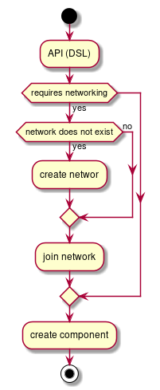

#Network module
Network module should be responsible for the following:
- Maintain node connectivity to it's networks, similar to `NetworkManager` it will try to automatically bring the node networking up
- Network module, should work out of the box, without any configuration. Extra configurations or kernel flags MUST be honored to fine tune networking, for example setting up static ips, or ignore NICs in the automated bootstrap.
- Network module must abstract creation of virtual networks as follows:
  - Provide interface to create a LAN given it's name, and sub-net. Internally this can use bridges and dnsmasq to server connected devices
  - Provide an interface to create a new member in that lan, the interface name then can be used by other modules running in the system (containers, or vms)
  - Network creation is required before adding members to the network, the unique network name is used later to add members
  - Networks type supported are
    - bridge
    - vlan
    - vxlan 
    - zerotier
    - MacVLan
    - PassThrough
    - others ? ...
  - Network types implementation can have restrictions on the members, for example how many members can join the network
  - Once a member joins the network, it's ownership can be moved to other modules to work with it (container, vms, etc...)

## Interface
```go
type NetworkType int 

const (
    Bridge NetworkType = iota
    VLan
    VXLan
    Zerotier
    MacVLan
    PassThrough
)

type Settings struct {
    // TO BE DEFINES
    // Settings will depend probably on network type
    // ...
    // Generic config
    Network struct {
        DHCP bool
        Cidr string
        Gateway string
        DNS []string
    }
}

type Member string {
    Name string
    MAC string
    Namespace string
}

type PortForwards map[string]uint32

type Network interface {
    // Create, creates a network with given name, type and settings
    func Create(name string, networkType NetworkType, settings Settings) error
    // Delete a network, fails if network has a joined members.
    func Destroy(name string) error
    // Join, asks a member to join a network.
    // A nic name depends on the network type you are joining can be required or not.
    // For example, an empty network name will probably create a virtual nic (veth) in case of a bridge. Or required in case of passthrough network. 
    // PortForwards must be accepted, if not possible to apply the forwards, due to network type does not support it, or conflicting, an error must be returned
    func Join(network, nic string, ports PortForwards) (Member, error)
    // Leave, leave a network, clean up and clear all assigned resources
    func Leave(network, nic string) error
}
```

## Implementation
- OpenvSwitch is the only switch software we gonna integrate with at least in the first release. All networking types will be done with openvswitch bridges (except ZeroTier) even for simple bridges.
- Join, and Leave depends entirely on the network type. So behavior can't fully be described at this stage.
- The network module, MUST insure isolation of the separate networks. (nft tables, and/or network namespaces)
- No support for add/remove port forwards after a member join a network.
- Not all network types can support port forwards, the `join` should return proper error if it's not possible to apply the rules.

# Diagram
