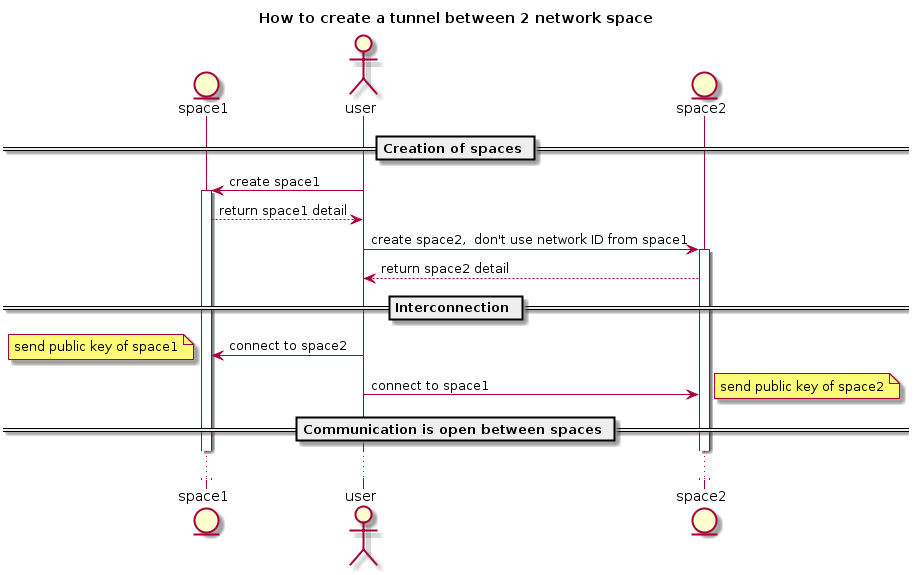

# Network module

Network module should be responsible for the following:

- Maintain node connectivity to its networks, similar to `NetworkManager` it will try to automatically bring the node networking up
- Network module, should work out of the box, without any configuration. Extra configurations (API driven or from external config store) MUST be honored to fine tune networking, for example setting up static ips, or ignore NICs in the automated bootstrap.
- Network module should provide the following features:
  - creation of any number of private network spaces per user
  - API to configure inter network space communication between different nodes. A user having different network space on different node needs to be able to make network spaces on both nodes to communicate
  - A user network space should be able to route traffic in the space between containers, VM and to the outside.
  - Allow to configure "fast" network when available. This is use for farm that have GB NICs between nodes of the farm. support for bonding, ...
  - Ability to configure a "router reflector" in big farm to reduce noise between node (To be further defined @delandtj)

## Interface

To be defined

## Implementation

So far the choice of technologies:

- For network isolation: [FRR](https://frrouting.org), VFR
- For inter node communication: [wireguard](https://www.wireguard.com/)
- For security and flow control: [Open vSwitch - Open flow](http://docs.openvswitch.org/en/latest/)

## Diagrams

Basic flow for network space creation:

Wireguard inter connection:
