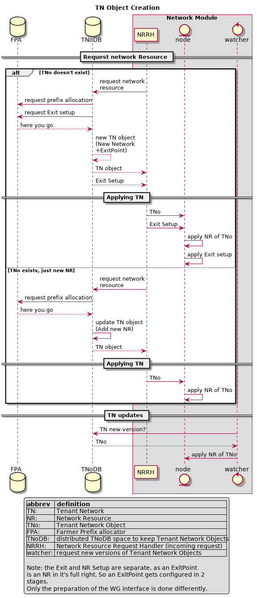

# Network module

Network module should be responsible for the following:

- Maintain node connectivity to its networks, similar to `NetworkManager` it will try to automatically bring the node networking up
- The network module should work out of the box, without any configuration. Extra configurations (API driven or from external config store) MUST be honored to fine tune networking, for example setting up static ips, or ignore NICs in the automated bootstrap.
- Network module should provide the following features:
  - creation of any number of private network spaces per user
  - A user network space should be able to route traffic in the space between containers, VM and to the outside.
  - Allow to configure "fast" network when available. This is use for farm that have GB NICs between nodes of the farm. support for bonding, ...
## [Some considerations](Requirements.md) (read first)

## Interface

Some definitions first : (nomenclature)

  - A network, Tenant Network, TN
  A Tenant Network is all the network resources (netresource, NR) that a user (tenant) has bought and for which a transaction exists.
  That means:
    - in every node there is a watcher that verifies if the TN has a new version
    - for every new version of that network, a node applies the configuration of the NR, that is:
      - update the NR container/vrf
      - update the wireguard configuration
      - update eventual IPv{6,4?} necessary service (dnsmasq/radvd...)

  - A Network Resource (netresource, NR)
  A netresource is a single entity in a node that contains:
    - a routing namespace (or a VRF, tbd) like a kubernetes pause container, that holds interconnects to other NR of a network, can have a bridge attached for connecting standalone containers/vms.
    - services to run that network (IPv6 is not plug and play all the way)
    - contains routes to other NRs throug which wg/bridge/vxlan/IPSec GRE
    - contains the watcher for new versions of the TN

## Implementation

[A preliminary layout of how a `Network` should look like](datastructs.md)

## Research
So far the choice of technologies to research on:

- For network isolation: [FRR](https://frrouting.org), VFR
- For inter node communication: [wireguard](https://www.wireguard.com/)
- For security and flow control: [Open vSwitch - Open flow](http://docs.openvswitch.org/en/latest/)

