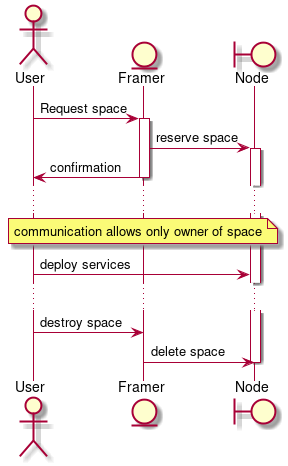

# Space reservation process
In this document, we explain how a user reservation for capacity is accomplished.
## Definitions
### Space
A space is a set of cpu, memory, storage, and network capacity that is owned by one user. The owner then has
the right to consume these resource in the form of containers, and/or virtual machines. 
- Storage is always encrypted, the encryption key is generated during the space provisioning procedure.
- the space API gives the user all the endpoints to provision actual services, in the form of containers, and virtual machines.

### Farmer
A farmer is the owner and maintainers of the physical nodes. A farmer may also refer to the farmer controller (or bot) that process
user requests to reserve [space](#space).

### Node
Node is the building block of a farm. Each node provide a single API only accessible by the [farmer](#farmer) that allows him to create [spaces](#space).

The node farmer API will provide the following:
- create space
- delete space
- list spaces
- get space consumption
- read the node health signals

### Farm
A farm is a set of [nodes](#node) that are owned by a single [farmer](#farmer).

### Market
A market, is a platform where u can find and compare [farmers](#farmer). After selecting the proper provider in terms of price, up time, rating, etc... A user can ask for space reservation. After a space is reserved, user can have direct access to his space(s) to deploy high level solutions.

## Process

