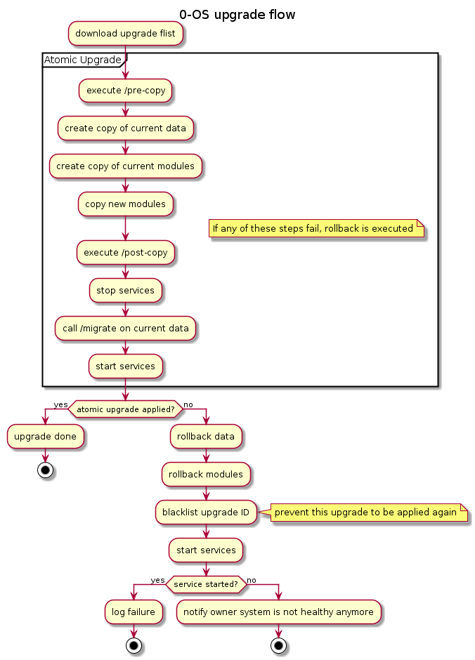

# 0-OS upgrade

## Philosophy

0-OS is meant to be a black box no one can access. While this provide some nice security features it also makes it harder to manage. Specially when it comes to update/upgrade.

Since 0-OS is meant to be driven by some blockchain transaction, The version of the software running on 0-OS could also be driven by a consensus of technical people agreeing on a new version to deploy.

Once a new version of a component is ready, a multisig transaction is created by the 0-OS team and X number of person needs to sign the transaction to approve the deployment of the new version.

Using a blockchain a source for upgrade gives us the ability to create different version of the grid. Version matching the different network of the blockchain:

- Dev: ephemeral network only setup to develop and test new features. Can be created and reset at anytime
- Test: Mostly stable feature that needs to be tested at scale, allow preview and test of new features. Always the latest greatest. This network can be rest sometimes, by should be relatively stable.
- Main: Released of stable version. Used to run the real grid with real money. Cannot be reset ever. Only stable and battle tested feature reach this level.

Since the upgrade will be trigger by a transaction on the blockchain, building a network of node using the same version is as simple as just pointing which network of the blockchain to watch.

The upgrade transaction should container a description and signature of all the new component to install. This allow to ensure the binaries installed on the node are actually a binary exact copy of what as been announced on the blockchain.

0-OS could even periodically verify that all the modules it is running are not corrupted or modified by comparing the hash of the binary to the content of the blockchain.

## Technical

0-OS is design to provide maximum uptime for its workload, so rebooting a node should never be required to upgrade any of its component (except when we will push a kernel upgrade).

The only way to get code onto a 0-OS is using flist. An upgrade flist will be composed of the new binary to install and in some case a migration scripts.

The content of the upgrade flist will be cached on disk, so in the event of a power failure, the node can just restart and restart all the workloads without downloading all the new modules again.



### Flist upgrade layout

The files in the upgrade flist needs to be located in the filesystem tree at the same destination they would need to be in 0-OS. This allow the upgrade code to stays simple and only does a copy from the flist to the cache disk of 0-OS.

Some hooks scripts will be executed during the upgrade flow if there are present in the flist. These files needs to be executable, be located at the root of the flist and named:

- pre-copy
- post-copy
- migrate
- post-start

Example:

0-OS filesystem:

```
root
├── bin
    ├── containerd
    └── runc
```

upgrade flist:

```
root
├── bin
│   ├── flist_module_0.2.0
│   └── containerd
├── etc
|   └── containerd
|       └── config.toml
├── migrate
├── post-copy
├── post-start
└── pre-copy
```

After upgrade:

```
root
├── bin
│   ├── containerd
│   ├── flist_module_0.1.0
│   └── runc
└── etc
    └── containerd
        └── config.toml
```

### Upgrade watcher

This component is going to be responsible to watch new upgrade being publish on the blockchain. He's also going to be the one driving the upgrade. Its responsibilities will be:

- watch upgrade publication
- schedule upgrade
  - it always needs to aim for a minimal to no downtime if possible.
  - if some downtime is required, arrange to make it during a low traffic hour to impact as less as possible the users.
- in the event of the cache being corrupted, it will need to re-downloads all the component requires to run the workload present on the node. Some workload might still required previous version of some component, so during re-population of the cache it needs to make sure to grab all the versions required.
