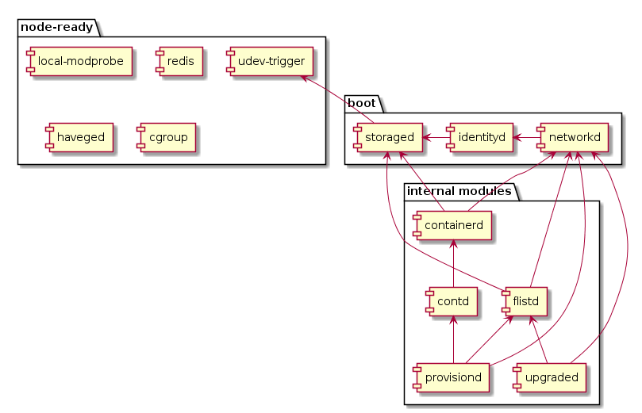

# Services Boot Sequence

Here is dependency graph of all the services started by 0-OS:

## Pseudo boot steps

both `node-ready` and `boot` are not actual services, but instead they are there to define a `boot stage`. for example once `node-ready` service is (ready) it means all crucial system services defined by 0-initramfs are now running.

`boot` service is similar, but guarantees that some 0-OS services are running (for example `storaged`), before starting other services like `flistd` which requires `storaged`
